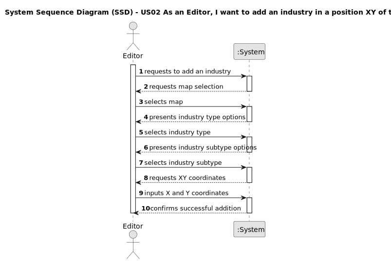

# US02 - As an Editor, I want to add an industry in a position XY of the selected map.

<!-- _XXX stands for User Story number and YYY for User Story description (e.g. US006 - Create a Task)_
 -->

## 1. Requirements Engineering

### 1.1. User Story Description

As an Editor, I want to add an industry in a position XY of the selected map.

### 1.2. Customer Specifications and Clarifications 

From the project requirements document, industries are static elements that can be placed on a map.

### 1.3. Acceptance Criteria

- Industries must be placed at valid XY coordinates within map boundaries
- Industry type must be selected from available options
- Industry subtype must be selected from available options for the chosen type
- Industry placement must respect minimum spacing from other map elements

### 1.4. Dependencies

- **US01** - A map must be created before an industry can be added to it

### 1.5 Input and Output Data

Input Data:
- Selected map (selection from a list)
- Industry type (selection from available types)
- Industry subtype (selection from available subtypes)
- X coordinate (typed value)
- Y coordinate (typed value)

Output Data:
- Success/failure message
- Updated map with the industry placed at the specified position

### 1.6. System Sequence Diagram (SSD)

**Simplified Success Case Flow:**

1. Editor requests to add an industry
2. System requests map selection
3. Editor selects map
4. System presents industry type options
5. Editor selects industry type
6. System presents industry subtype options
7. Editor selects industry subtype
8. System requests XY coordinates
9. Editor inputs X and Y coordinates
10. System confirms successful addition