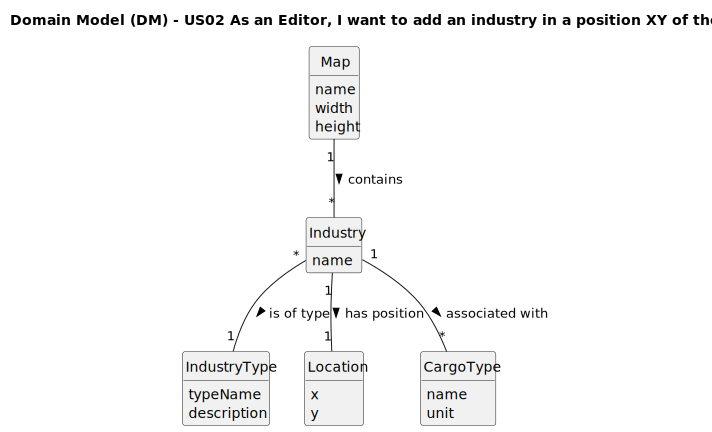

# US02 - As an Editor, I want to add an industry in a position XY of the selected map.

## 2. Analysis

### 2.1. Relevant Domain Model Excerpt 

The domain model excerpt shows the following classes and their relationships:

- **Map**: Represents the rectangular area where industries can be placed
  - Has attributes: name, width, height
- **Industry**: Abstract class that represents any industry
  - Has attribute: name
- **IndustryType**: Entity defining the available industry types
  - Has attribute: description
  - Enumerated values: MINE, FARM, BAKERY, TEXTILE, AUTOMOBILE, STEEL_MILL, PORT
- **Location**: Represents the XY coordinates where an industry is placed
  - Has attributes: x, y
- **CargoType**: Defines the resources and products associated with industries
  - Has attribute: unit
  - Enumerated values: PASSENGERS, MAIL, COAL, IRON_ORE, STEEL, CARS

The relationships show that:

- A Map contains multiple Industries (1-to-many relationship)Add commentMore actions
- Each Industry has exactly one Location (1-to-1 relationship)
- Each Industry is associated with specific CargoType objects for input/output (1-to-many relationship)
- Each Industry is of a specific IndustryType (many-to-1 relationship)

### 2.2. Other Remarks

- Industries are static elements on the map, meaning once placed, they remain at fixed positions. However, their properties and behaviors may vary based on the scenario's configurations.

- For primary industries (represented by MINE and FARM industry types), they generate resources that can be transported and used by transforming industries. Transforming industries (like BAKERY, TEXTILE, AUTOMOBILE, STEEL_MILL) consume resources from primary industries and produce new products. Mixed industries like ports (PORT type) can import or export various types of cargo depending on scenario configurations.

- The process of adding an industry involves validation of:Add commentMore actions
1. Map existence
2. Validity of XY coordinates (within map boundaries)
3. Space availability at the selected position (to avoid overlapping)
4. Minimum distance requirements from other map elements
5. Consistency of industry type with scenario constraints

- Industries only interact with the railway network if they are served by a station, which is a separate entity that will be implemented in other user stories. The cargo generation patterns of each industry (US12) will depend on the industry type and scenario settings.