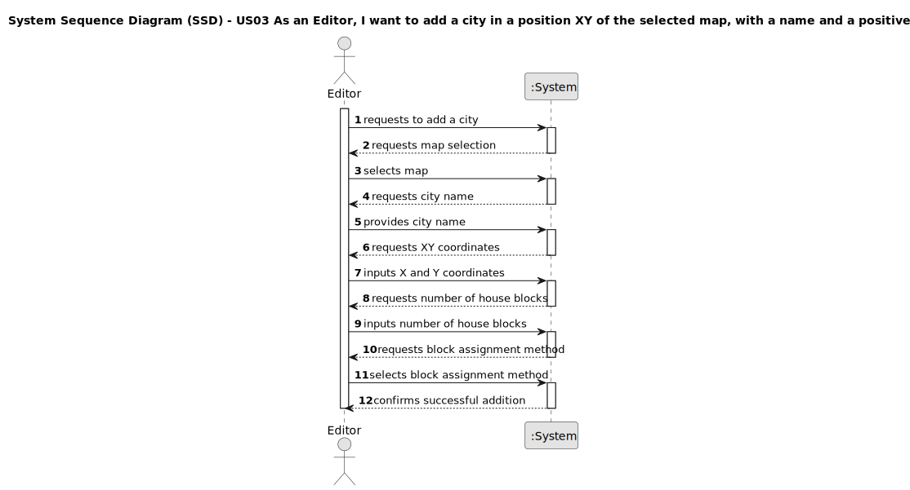

# US03 - As an Editor, I want to add a city in a position XY of the selected map, with a name and a positive number of house blocks.

## 1. Requirements Engineering

### 1.1. User Story Description

As an Editor, I want to add a city in a position XY of the selected map, with a name and a positive number of house blocks.

### 1.2. Customer Specifications and Clarifications 

The enunciado specifies that:

- Cities are static elements on a map.
- A city has:
  - A name
  - A location (with XY coordinates on the map)
  - A set of blocks that represent housing
- In the simulator's context, cities generate and consume passengers and mail, and they also consume final products (e.g., food, textiles, cars).

My interpretation is that the editor needs functionality to create cities at specific XY coordinates on a previously created map, assign a name to the city, and specify the number of housing blocks the city will have.

### 1.3. Acceptance Criteria

- AC1: A city name cannot have special characters or digits.
- AC2: The house blocks can be assigned manually or automatically (randomly around the city tag position).
- The number of housing blocks must be positive.
- Each city must have a unique name on the map.
- City must be placed at valid XY coordinates within map boundaries.
- House blocks must maintain minimum spacing from each other and other map elements.
- City size (number of house blocks) must be consistent with expected passenger and cargo demand.

### 1.4. Found out Dependencies

- **US01** - A map must be created before a city can be added to it.
- **US12** - City size will impact the quantity of passenger, mail, and product demands in cargo generation.

### 1.5 Input and Output Data

Input Data:
- Selected map (selection from a list)
- City name (typed value)
- X coordinate (typed value)
- Y coordinate (typed value)
- Number of house blocks (typed value)
- Method of block assignment (selection: manual or automatic)
- If manual: coordinates for each block (typed values)

Output Data:
- Success/failure message
- Updated map with the city placed at the specified position
- Visualization of house blocks placement

### 1.6. System Sequence Diagram (SSD)

**Simplified Success Case Flow:**

1. Editor requests to add a city
2. System requests map selection
3. Editor selects the map
4. System requests city name
5. Editor provides city name
6. System requests XY coordinates
7. Editor inputs X and Y coordinates
8. System requests number of house blocks
9. Editor inputs number of house blocks
10. System requests block assignment method
11. Editor selects block assignment method
12. System confirms successful addition

### 1.7 Other Relevant Remarks

- The city addition functionality will be frequently used during map creation, as cities are key components in the railway network simulation.
- The ability to choose between manual and automatic block placement provides flexibility to editors with different needs.
- Cities interact with the railway network only if they are served by a station (implemented in other user stories).
- The number of house blocks directly correlates with the city's population, which affects passenger, mail, and goods demand in the simulation (US12).