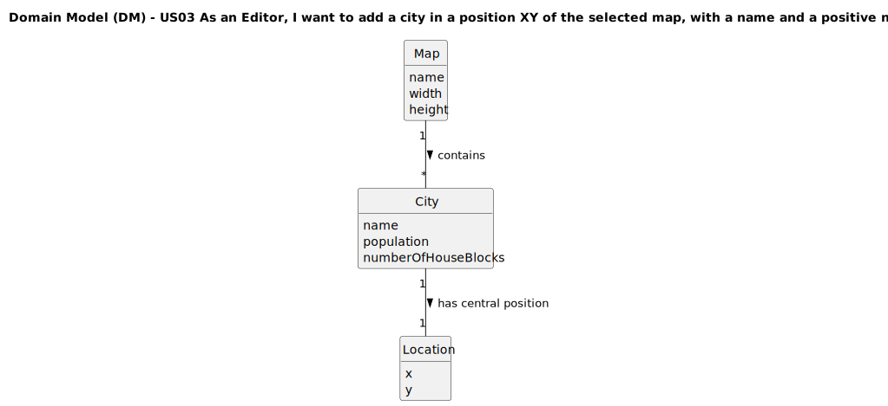

# US03 - As an Editor, I want to add a city in a position XY of the selected map, with a name and a positive number of house blocks.

## 2. Analysis

### 2.1. Relevant Domain Model Excerpt 

The domain model excerpt shows the following classes and their relationships:
- **Map**: Represents the rectangular area where cities can be placed
  - Has attributes: name, width, height
- **City**: Represents a populated area with a name and housing blocks
  - Has attributes: name, population, numberOfHouseBlocks
- **Location**: Represents the XY coordinates where a city is placed
  - Has attributes: x, y

The relationships show that:
- A Map contains multiple Cities (1-to-many relationship)
- Each City has exactly one central Location (1-to-1 relationship)

### 2.2. Other Remarks

Cities are static elements on the map. Once placed, they remain at fixed positions. The name of a city must follow specific rules (no special characters or digits) to maintain consistency and readability.

House blocks can be placed either manually (by specifying coordinates for each block) or automatically (randomly placed around the city's central position). The automatic placement algorithm should ensure that blocks are reasonably distributed around the city center without overlapping and maintain minimum spacing requirements.

In the context of the simulator (US12), cities serve as sources and destinations for passengers and mail. They also consume certain products produced by industries. The population size, determined by the number of house blocks, directly affects:
- Passenger traffic volume
- Mail volume
- Consumption rates of final products (food, textiles, etc.)

The city addition process requires validation of:
1. Map existence
2. City name format (no special characters or digits)
3. Validity of XY coordinates (within map boundaries)
4. Positive number of house blocks
5. Space availability at the selected positions (to avoid overlapping with other elements)
6. Logical distribution of house blocks (not too sparse or too dense)

Cities will interact with the railway network through stations (US05), which is a separate entity that will be implemented in other user stories. The cargo generation system (US12) will use the city's size and characteristics to determine appropriate demand levels for various cargo types.