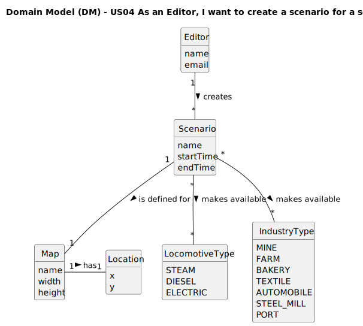

# US04 - Create a Scenario for a Selected Map

## 2. Analysis

### 2.1. Relevant Domain Model Excerpt 

### 2.2. Other Remarks

From the analysis, we can observe that:

1. A Scenario is created for a single Map (1-to-1 relationship).
2. A Scenario defines technological restrictions by specifying which LocomotiveTypes and IndustryTypes are available.
3. Historical events are represented as text descriptions within a Scenario.
4. Each Scenario has a specific time period with start and end dates.
5. The Map contains various Elements that represent the physical components of the game world.