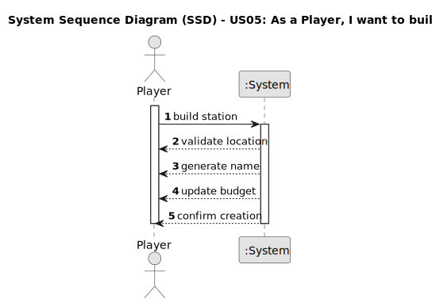

# US05 - As a Player, I want to build a station.

## 1. Requirements Engineering

### 1.1. User Story Description

As a player, I want to build a station (Depot, Station, or Terminal) at a valid location on the map to establish a railway network.
### 1.2. Customer Specifications and Clarifications

From the specifications document:

- A station is an essential component of the railway network, allowing industries and cities to generate and consume cargo.
- There are three types of stations: Depot, Station, and Terminal. Each has a different cost and economic radius.
- The system auto-generates a name for the station (e.g., "Porto Terminal") based on the nearest city

### 1.3. Acceptance Criteria

- **AC1:** Valid map coordinates (positive integers within map bounds)
- **AC2:** Station type must be selected from available options
- **AC3:** No overlapping with existing stations/buildings
- **AC4:** Sufficient funds verification before construction
- **AC5:** Correct automatic naming based on nearest city

### 1.4. Found out Dependencies

- There is a dependency on "US01 - Create a Map" since a station must be placed on an existing map.
- There is a dependency on "US03 - Add a City" and "US02 - Add an Industry" as stations are typically built near these entities.

### 1.5. Input and Output Data

Input Data:
- Station type (Depot/Station/Terminal).
- XY coordinates on the map.
- Current player funds.

Output Data:
- Success confirmation.

### 1.6. System Sequence Diagram (SSD)

1. Player initiates station construction
2. System performs validations:
- Location availability 

- Funds verification 

- Nearest city detection 

3. System updates game state:

- Deducts construction cost

- Creates station entity

- Updates spatial index

4. System returns construction result

### 1.7. Other Relevant Marks
The station-building functionality is a core feature of the railway network simulation, as stations serve as essential hubs for cargo and passenger transport. The process should be optimized to ensure quick and efficient station placement while preventing invalid placements (e.g., overlapping with existing stations). 