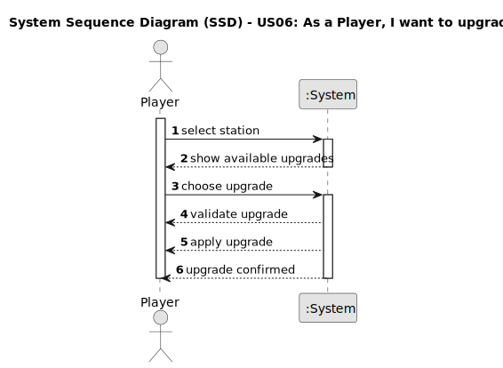

# US06 - As a Player, I want to upgrade a selected station with a building.

## 1. Requirements Engineering

### 1.1. User Story Description

As a Player, I want to upgrade a selected station with a building, so that I can improve its performance and functionalities.

### 1.2. Customer Specifications and Clarifications

From the specifications document:

Stations can be upgraded with additional buildings that enhance their performance, improve train operations, facilitate maneuvering, or extend cargo lifespan.

Some buildings are mutually exclusive (e.g., Small vs. Large Hotel).

Upgrades are era-dependent (e.g., Telegraph unavailable after Telephone invention).

Available buildings include:

- Telegraph/Telephone (Improves communication and scheduling)
- Café (Increases passenger traffic)
- Customs (Handles import/export operations)
- Post Office (Handles mail cargo)
- Hotel (Boosts passenger flow)
- Silo (Extends grain cargo lifespan)
- Liquid Storage (Extends liquid cargo lifespan)

### 1.3. Acceptance Criteria

- **AC1:** Display only era-appropriate upgrades
- **AC2:** Enforce mutual exclusivity rules during selection
- **AC3:** Verify station type compatibility 
- **AC4:** Prevent duplicate upgrades 
- **AC5:** Update station statistics immediately after upgrade
### 1.4. Found out Dependencies

- There is a dependency on "US05 - Build a Station" since a station must exist before it can be upgraded.

### 1.5. Input and Output Data

Input Data:
- Target station
- Selected upgrade

Output Data:
- Station upgraded with the building type

### 1.6. System Sequence Diagram (SSD)

1. Player selects a station

2. Player chooses upgrade 

- Era compatibility
- Station type restrictions
- Mutual exclusivity

3. System applies effects and confirms

### 1.7. Other Relevant Marks
Upgrading stations enhances their capabilities, making them more efficient in handling cargo and passengers. The upgrade process should be quick and user-friendly, ensuring that players can expand their railway network without excessive micromanagement. 