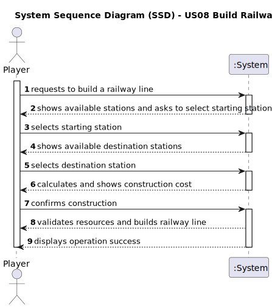

# US08 - Build a Railway Line Between Two Stations

## 1. Requirements Engineering

### 1.1. User Story Description

As a Player, I want to build a railway line between two stations to establish rail connections for cargo and passenger transportation.

### 1.2. Customer Specifications and Clarifications 

From the specifications document:

- Railway lines connect stations in the railway network
- A railway line must start and end at a station
- Railway lines have construction costs based on distance and terrain
- Multiple railway lines can connect to the same station
- Railway lines enable trains to transport cargo and passengers between stations

### 1.3. Acceptance Criteria

* **AC1:** The railway line must connect two existing stations
* **AC2:** The starting and ending stations must be different
* **AC3:** The player must have sufficient funds to build the railway line
* **AC4:** Railway lines cannot overlap with existing lines
* **AC5:** Railway lines must follow valid paths on the map (avoiding obstacles)

### 1.4. Found out Dependencies

* Requires stations to be built first (dependency on US05 - Build a Station)
* Depends on the map creation (US01) as railway lines are built on the map
* May depend on terrain and elevation features defined in the map

### 1.5 Input and Output Data

**Input Data:**
* Selected data:
    * Starting station
    * Ending station
    * Path points for the railway line (if custom routing is supported)
    
**Output Data:**
* Preview of the railway line path
* Construction cost estimate
* Success/failure message
* Updated map showing the new railway connection

### 1.6. System Sequence Diagram (SSD)

### 1.7 Other Relevant Remarks

* Railway construction is a core gameplay mechanic that enables the transportation network
* The cost of construction should be carefully balanced for gameplay purposes
* Future enhancements might include:
  * Different types of tracks (single/double track)
  * Track upgrades for higher speed limits
  * Maintenance costs over time
  * Bridge and tunnel construction for challenging terrain