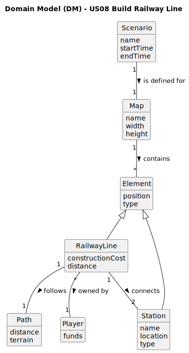

# US08 - Build a Railway Line Between Two Stations

## 2. Analysis

### 2.1. Relevant Domain Model Excerpt 

The domain model shows the following classes and their relationships:

* **Element**: Abstract class representing game world objects (from US04)
  - Has position on the map
  - Has a type identifier
  - Parent class for RailwayLine and Station

* **RailwayLine**: (Extends Element)
  - Has a construction cost
  - Must connect exactly two stations
  - Follows a specific path

* **Station**: (Extends Element)
  - Has a name and location
  - Has a specific type (depot, station, terminal)

* **Path**: Represents the physical route of the railway line
  - Has distance for cost calculation
  - Contains terrain information
  - Must be valid within map constraints

* **Map**: (From US04)
  - Contains game world elements
  - Has dimensions (sizeX, sizeY)
  - Contains stations and railway lines

* **Player**:
  - Has available funds
  - Can own multiple railway lines
  - Must pay construction costs

* **Scenario**: (From US04)
  - Defines the game context
  - Has a time period (start/end)
  - Associated with one map

### 2.2. Other Remarks

1. Path finding should consider:
   - Terrain elevation and obstacles
   - Existing railway lines to prevent overlap
   - Distance calculation for costs
   - Valid connection angles at stations

2. Construction costs need to factor in:
   - Total path distance
   - Terrain difficulty
   - Any special structures needed (bridges, tunnels)
   - Economic balance for gameplay

3. Technical validations required:
   - Station existence and availability
   - Player's financial resources
   - Path validity and clearance
   - Connection point compatibility
   - Scenario time period constraints