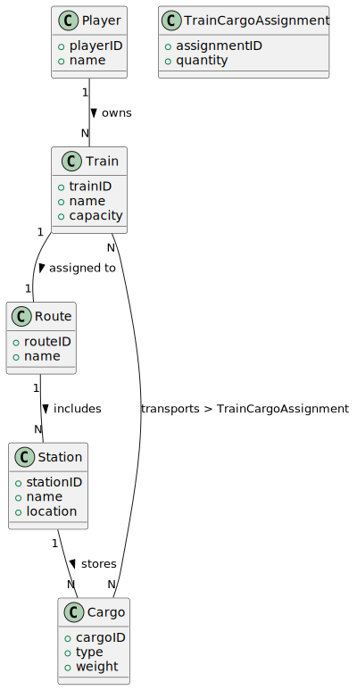

# US10 -  As a Player, I want to assign a selected train to a route with a valid station and the respective list of cargoes to be picked up.
 
 ## 2. Analysis
 
 ### 2.1. Relevant Domain Model Excerpt 
 
 
 
 The domain model excerpt shows the following classes and their relationships:
 - **Player**: Represents the player in the system and owns a collection of trains.
 - **Train**: A train available for assignment.
 - **Route**: Defines a specific path that a train can travel.
 - **Station**: Represents a stopping point within a route and has loads available for transportation.
 - **Cargo**: It has specific weight and volume.
 - **TrainCargoAssignment**: Relates a train to the loads transported.

 The relationships show that:
 - Player → Train → A player can have multiple trains.

 - Train → Route → A train can be assigned to a single route at a time.

 - Route → Station → A route can contain multiple stations.
 
 ### 2.2. Other Remarks
 
 - The Route must contain a valid station, or train assignment will not be allowed.
 - It should only be possible to show the list of loads if the train is on a valid route and it has been created.