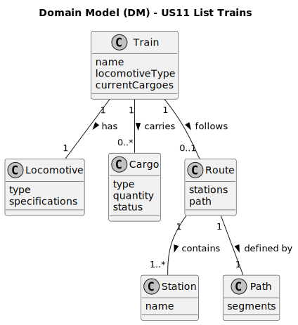

# US11 - Analysis

## Domain Model

### Relevant Domain Model Excerpt

### Domain Model Description

The relevant entities for listing trains are:

* **Train**
  * Represents a train in the game
  * Has attributes:
    * Name
    * Locomotive type
    * Current cargoes
    * Current route (optional)

* **Locomotive**
  * Represents the type of locomotive
  * Has attributes:
    * Type name
    * Specifications

* **Cargo**
  * Represents cargo being transported
  * Has attributes:
    * Type
    * Quantity
    * Source/Destination

* **Route**
  * Represents the assigned route
  * Has attributes:
    * Stations
    * Path

### Domain Rules/Invariants

1. Each train must have exactly one locomotive type
2. A train may have zero or more cargoes
3. A train may be assigned to at most one route at a time
4. Train names must be unique within the game
5. Trains must be grouped by locomotive type when displayed
6. Within each locomotive type group, trains must be sorted alphabetically by name 
