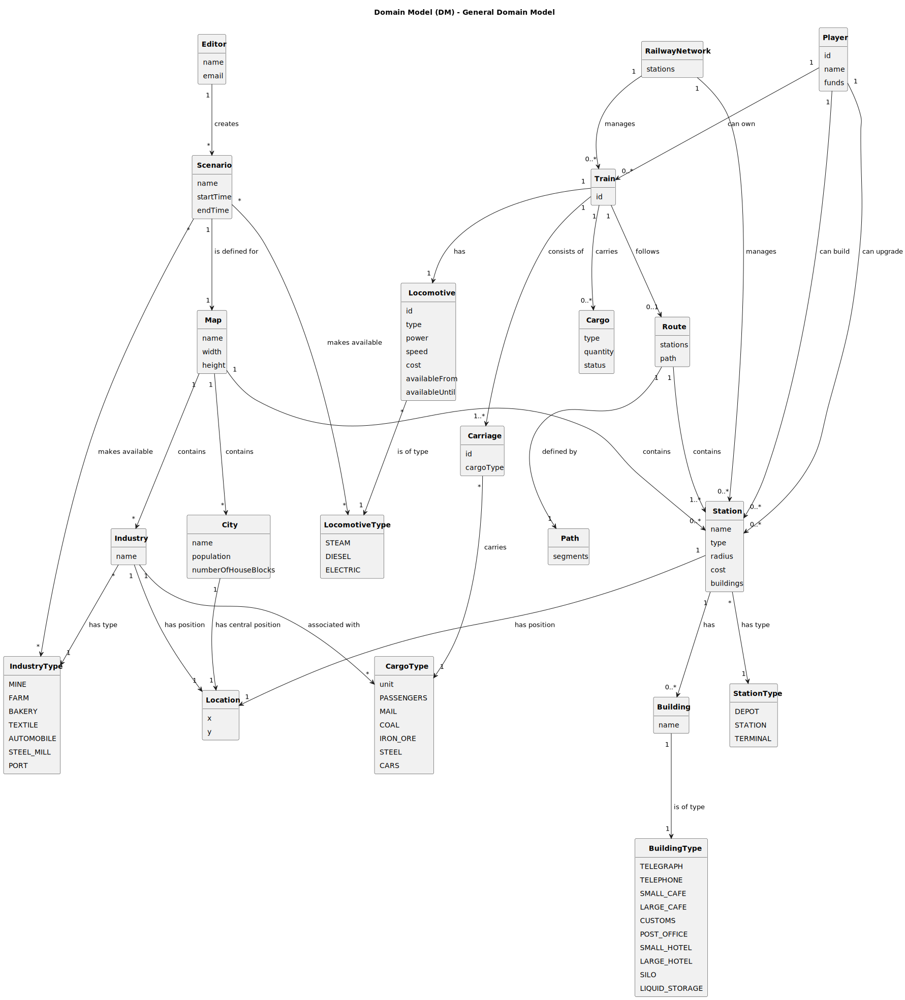

# OO Analysis

The construction process of the domain model is based on the client specifications, especially the nouns (for _concepts_) and verbs (for _relations_) used. 

## Rationale to identify domain conceptual classes
To identify domain conceptual classes, start by making a list of candidate conceptual classes inspired by the list of categories suggested in the book "Applying UML and Patterns: An Introduction to Object-Oriented Analysis and Design and Iterative Development". 

### _Conceptual Class Category List_

**Business Transactions**

- Buying a Train

- Upgrading a Station

- Transporting Cargo

---

**Transaction Line Items**

- Train Purchase

- Station Upgrade

- Cargo Transport

---

**Product/Service related to a Transaction or Transaction Line Item**

- Locomotive

- Carriage

- Cargo

---

**Transaction Records**

- Funds (Player)

- Available Locomotives (Scenario) 

---  

**Roles of People or Organizations**

- Player

- Editor 

---

**Places**

- Map

- City

- Industry

- Station 

- Location

---

**Noteworthy Events**

- Train purchase

- Industry production

- Cargo delivery

- Scenario creation

---

**Physical Objects**

- Train

- Locomotive

- Carriage

- Cargo 

- Building

---

**Descriptions of Things**

- Station Type

- Locomotive Type

- Industry Type

- Cargo Type 

---

**Catalogs**

- Locomotive availability in Scenarios

- Industry Types available in Scenarios

---

**Containers**

- Route (contains Stations)

- Path (contains Segments)

- Train (contains Carriages) 

- Railway Network (contains Stations and Trains)

---

**Elements of Containers**

- Station (part of a Route)

- Carriage (part of a Train)

- Building (part of a Station) 

- Segment (part of a Path)

---

**(Other) Organizations**

- Railway Network (manages Stations & Trains) 

---

**Records of finance, work, contracts, legal matters**

- Funds (Player)

---

**Financial Instruments**

- Cost (Train, Station, Locomotive) 

---

**Documents mentioned/used to perform some work**

- Scenario

---

## Rationale to identify associations between conceptual classes

| Concept (A) 		  |   Association   	    |     Concept (B) |
|-----------------|:--------------------:|----------------:|
| Player  	       |   can own    		 	    |           Train |
| Player  	       |  can build    		 	   |         Station |
| Player          |     can upgrade      |         Station |
| Player          |      has funds       |               - |
| Editor          |       creates        |        Scenario |
| Scenario        |    is defined for    |             Map |
| Scenario        |   makes available    | Locomotive Type |
| Scenario        |   makes available    |   Industry Type |
| Map             |       contains       |            City |
| Map             |       contains       |         Station |
| Map             |       contains       |        Industry |
| City            | has central position |        Location |
| City            |    has population    |               - |
| City            |   has house blocks   |               - |
| Industry        |     has position     |        Location |
| Industry        |       has type       |   Industry Type |
| Industry        |   associated with    |      Cargo Type |
| Station         |     has position     |        Location |
| Station         |         has          |        Building |
| Station         |       has type       |    Station Type |
| Train           |         has          |      Locomotive |
| Train           |     consists of      |        Carriage |
| Train           |       carries        |           Cargo |
| Train           |       follows        |           Route |
| Route           |       contains       |         Station |
| Route           |      defined by      |            Path |
| Railway Network |       manages        |         Station |
| Railway Network |       manages        |           Train |
| Locomotive      |      is of type      | Locomotive Type |
| Carriage        |       carries        |      Cargo Type |
| Cargo           |       has type       |      Cargo Type |
| Building        |      is of type      |   Building Type |
| Path            |       contains       |         Segment |

## Domain Concepts and their Attributes

### User Entities
- **Editor**: name, email
- **Player**: id, name, funds

### Map Elements
- **Map**: name, width, height
- **Scenario**: name, startTime, endTime
- **Location**: x, y
- **City**: name, population, numberOfHouseBlocks
- **Industry**: name

### Types and Classifications
- **IndustryType**: MINE, FARM, BAKERY, TEXTILE, AUTOMOBILE, STEEL_MILL, PORT
- **StationType**: DEPOT, STATION, TERMINAL
- **LocomotiveType**: STEAM, DIESEL, ELECTRIC
- **CargoType**: PASSENGERS, MAIL, COAL, IRON_ORE, STEEL, CARS

### Railway Infrastructure
- **RailwayNetwork**
- **Station**: name, type, radius, cost, buildings
- **Building**: name
- **Path**: segments

### Train and Transportation
- **Train**: id
- **Locomotive**: id, type, power, speed, cost, availableFrom, availableUntil
- **Carriage**: id, cargoType
- **Cargo**: type, quantity, status
- **Route**: stations, path

