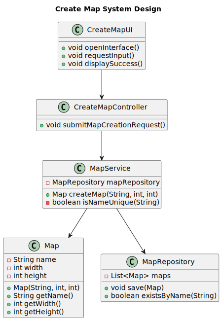

# US01 - As an Editor, I want to create a map with a size and a name.

## 3. Design

### 3.1. Rationale

**The rationale grounds on the SSD interactions and the identified input/output data.**

| Interaction ID | Question: Which class is responsible for... | Answer  | Justification (with patterns)  |
|:-------------  |:--------------------- |:------------|:---------------------------- |
| Step 1  		 | ...interacting with the editor? | CreateMapUI | Pure Fabrication: UI class handles user interaction |
| Step 2  		 | ...coordinating the US? | CreateMapController | Controller Pattern: coordinates the use case |
| Step 3  		 | ...validating map name? | MapService | Information Expert: service knows about existing maps |
| Step 4  		 | ...validating map size? | Map | Information Expert: map knows its size constraints |
| Step 5  		 | ...creating the map? | MapService | Information Expert: service handles map creation |
| Step 6  		 | ...saving the map? | MapRepository | Repository Pattern: responsible for persistence |

### Systematization

According to the taken rationale, the conceptual classes promoted to software classes are:

* Map

Other software classes (i.e. Pure Fabrication) identified:

* CreateMapUI  
* CreateMapController
* MapService
* MapRepository

## 3.2. Sequence Diagram (SD)

1. **Editor** opens the map creation interface.
2. **Editor** inputs the map name, width, and height.
3. **System** validates the map name for uniqueness.
4. **System** checks the size constraints.
5. **System** creates the map and saves it.
6. **System** returns a success message to the editor.

## 3.3. Class Diagram (CD)

