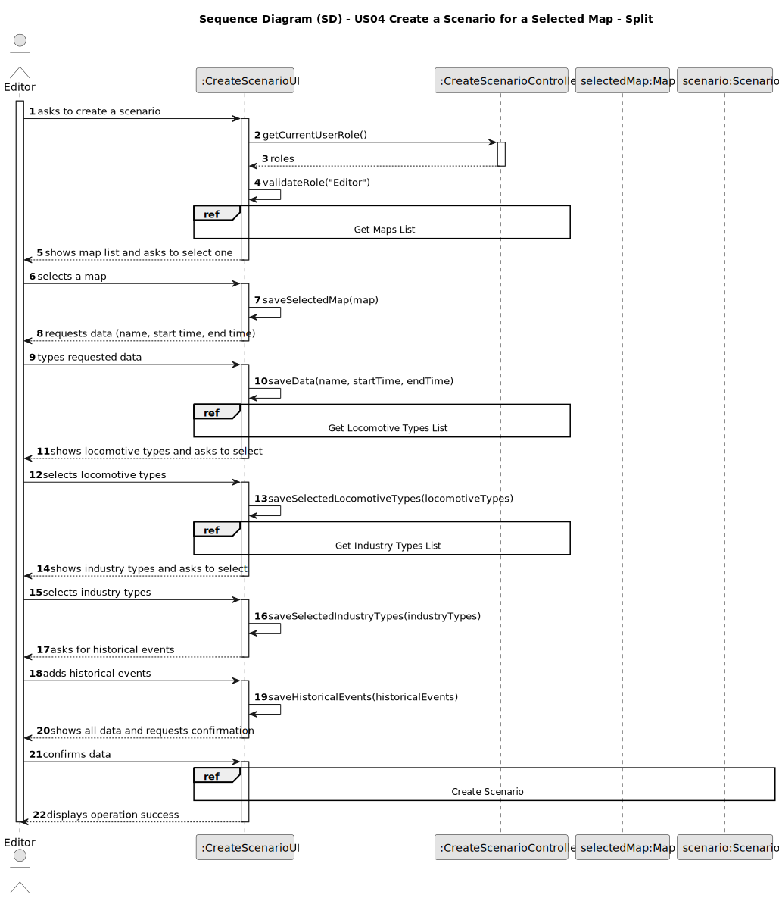
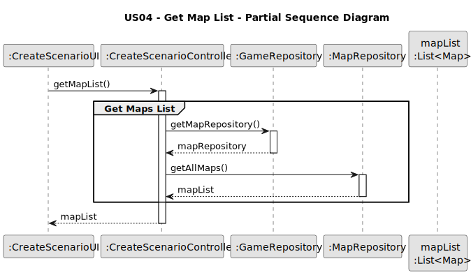
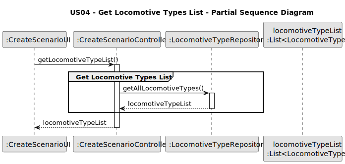
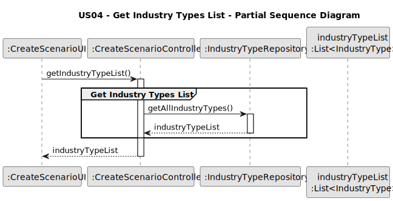
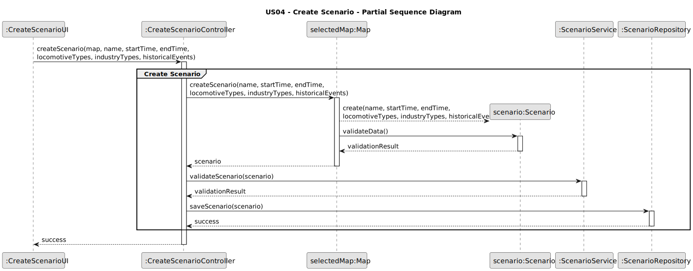
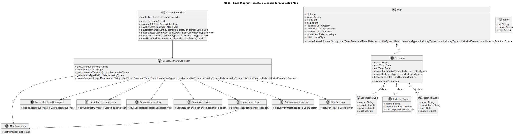

# US04 - Create a Scenario for a Selected Map

## 3. Design

### 3.1. Rationale

| Interaction ID | Question: Which class is responsible for...       | Answer                   | Justification (with patterns)                                                                                 |
|:---------------|:--------------------------------------------------|:-------------------------|:--------------------------------------------------------------------------------------------------------------|
| Step 1         | ... interacting with the actor?                   | CreateScenarioUI         | Pure Fabrication: there is no reason to assign this responsibility to any existing class in the Domain Model. |
|                | ... coordinating the US?                          | CreateScenarioController | Controller                                                                                                    |
|                | ... knowing the user using the system?            | AuthenticationService    | IE: cf. A&A component documentation.                                                                          |
|                |                                                   | UserSession              | IE: knows/has the currently logged in user                                                                    |
|                |                                                   | Editor                   | IE: knows its own data (e.g. role)                                                                            |
| Step 2         | ... knowing all existing maps to show?            | MapRepository            | IE: Maps are accessed through the repository.                                                                 |
|                |                                                   | GameRepository           | By applying High Cohesion (HC) + Low Coupling (LC), it delegates the responsibility to the MapRepository.     |
| Step 3         | ... saving the selected map?                      | CreateScenarioUI         | IE: is responsible for keeping the selected map.                                                              |
| Step 4         | ... requesting scenario data?                     | CreateScenarioUI         | IE: is responsible for user interactions.                                                                     |
| Step 5         | ... saving the inputted data?                     | CreateScenarioUI         | IE: is responsible for keeping the inputted data.                                                             |
| Step 6         | ... knowing all available locomotive types?       | LocomotiveTypeRepository | IE: Locomotive types are accessed through the repository.                                                     |
| Step 7         | ... saving selected locomotive types?             | CreateScenarioUI         | IE: is responsible for keeping the selected locomotive types.                                                 |
| Step 8         | ... knowing all available industry types?         | IndustryTypeRepository   | IE: Industry types are accessed through the repository.                                                       |
| Step 9         | ... saving selected industry types?               | CreateScenarioUI         | IE: is responsible for keeping the selected industry types.                                                   |
| Step 10        | ... requesting historical events data?            | CreateScenarioUI         | IE: is responsible for user interactions.                                                                     |
| Step 11        | ... showing all data and requesting confirmation? | CreateScenarioUI         | IE: is responsible for user interactions.                                                                     |
| Step 12        | ... instantiating a new Scenario?                 | Map                      | Creator (Rule 1): in the DM Map has Scenarios.                                                                |
|                | ... validating all data (local validation)?       | Scenario                 | IE: owns its data.                                                                                            |
|                | ... validating all data (global validation)?      | ScenarioService          | IE: knows the rules for scenario creation.                                                                    |
|                | ... saving the created scenario?                  | ScenarioRepository       | IE: responsible for persisting scenarios.                                                                     |
| Step 13        | ... informing operation success?                  | CreateScenarioUI         | IE: is responsible for user interactions.                                                                     |

### Systematization

According to the taken rationale, the conceptual classes promoted to software classes are:

- Map
- Scenario
- LocomotiveType
- IndustryType
- HistoricalEvent
- Editor

Other software classes (i.e. Pure Fabrication) identified:

- CreateScenarioUI
- CreateScenarioController
- GameRepository
- MapRepository
- ScenarioRepository
- LocomotiveTypeRepository
- IndustryTypeRepository
- ScenarioService
- AuthenticationService
- UserSession

## 3.2. Sequence Diagram (SD)

### Full Diagram

This diagram shows the full sequence of interactions between the classes involved in the realization of this user story.

### Split Diagrams

The following diagram shows the same sequence of interactions between the classes involved in the realization of this user story, but it is split in partial diagrams to better illustrate the interactions between the classes.

It uses Interaction Occurrence (a.k.a. Interaction Use).

**Get Maps List Partial SD**

**Get Locomotive Types List Partial SD**

**Get Industry Types List Partial SD**

**Create Scenario Partial SD**

## 3.3. Class Diagram (CD)

