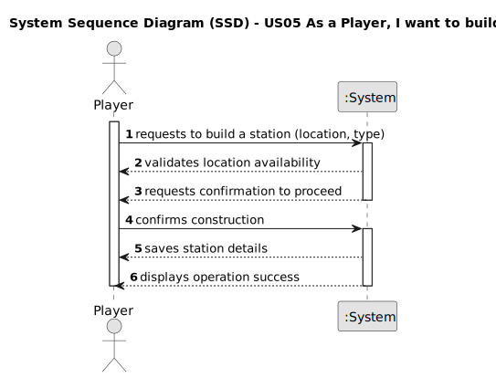

# US05 - As a Player, I want to build a station.

## 1. Requirements Engineering

### 1.1. User Story Description

As a player, I want to build a station so that I can establish a railway network.

### 1.2. Customer Specifications and Clarifications

From the specifications document:

- A station is an essential component of the railway network, allowing industries and cities to generate and consume cargo.
- There are three types of stations: Depot, Station, and Terminal. Each has a different cost and economic radius.

### 1.3. Acceptance Criteria

- **AC1:** The station must be placed at a valid location on the map.
- **AC2:** The player must select the type of station to build.
- **AC3:** Overbuilding is not possible.
- **AC4:** The system must validate the player's available budget before construction.

### 1.4. Found out Dependencies

- There is a dependency on "US01 - Create a Map" since a station must be placed on an existing map.
- There is a dependency on "US03 - Add a City" and "US02 - Add an Industry" as stations are typically built near these entities.

### 1.5. Input and Output Data

Input Data:
- Typed Data:
- Selection of station type (Depot, Station, Terminal)
- Select Data:
- A valid location on the map
- Confirmation of station placement

Output Data:
- Confirmation of successful station creation
- Error messages in case of invalid placement or insufficient funds

### 1.6. System Sequence Diagram (SSD)

1. Player requests to build a station, providing location and type.
2. System forwards the request to the Station Manager for validation.
3. Station Manager checks the database to see if the location is available.
4. Database returns the availability status to the Station Manager.
5. If the location is available:
- The Station Manager saves the new station in the database.
- The Database confirms the station creation.
- The Station Manager informs the System that the station was created successfully.
- The System sends a confirmation message to the Player.
6. If the location is occupied:
- The Station Manager informs the System that overbuilding is not allowed.
- The System displays an error message to the Player.

### 1.7. Other Relevant Marks
The station-building functionality is a core feature of the railway network simulation, as stations serve as essential hubs for cargo and passenger transport. The process should be optimized to ensure quick and efficient station placement while preventing invalid placements (e.g., overlapping with existing stations). Additionally, future expansions may include station upgrades or customization options.