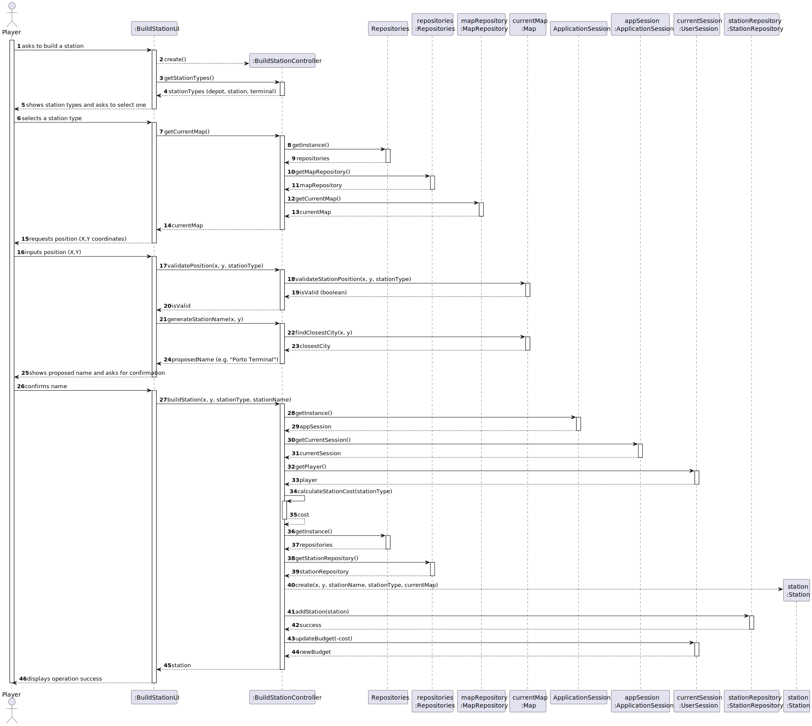
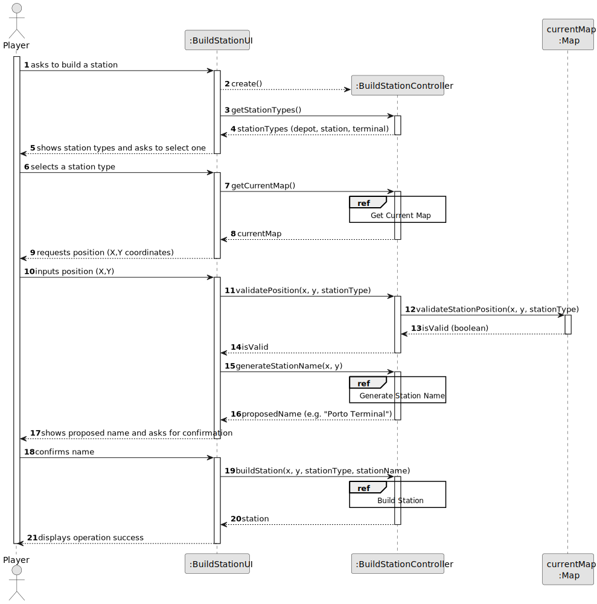
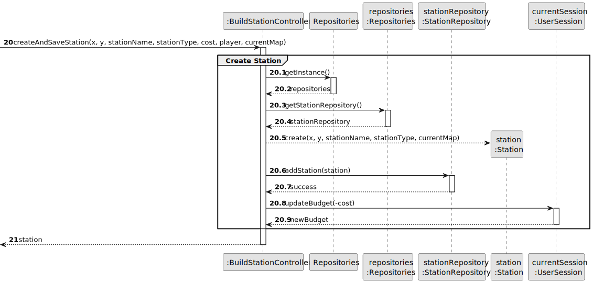
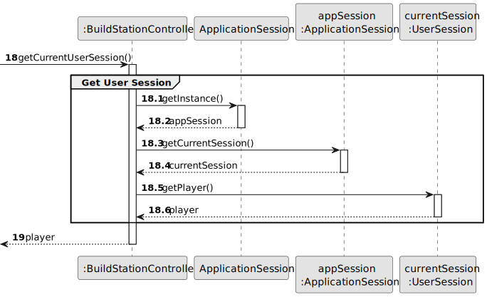
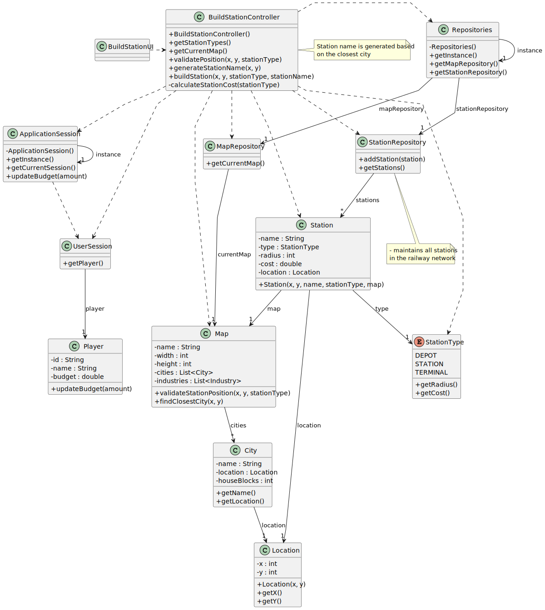

# US05 - As a Player, I want to build a station.

## 3. Design

### 3.1. Rationale

| Interaction ID | Question: Which class is responsible for... | Answer                 | Justification (with patterns)                                                                                              |
|:---------------|:--------------------------------------------|:-----------------------|:---------------------------------------------------------------------------------------------------------------------------|
| Step 1         | ... interacting with the actor?             | BuildStationUI         | Pure Fabrication: there is no reason to assign this responsibility to any existing class in the Domain Model.              |
|                | ... coordinating the US?                    | BuildStationController | Controller                                                                                                                 |
| Step 2         | ... knowing the stations types to show?     | BuildStationController | IE: contains the knowledge about available station types (DEPOT, STATION, TERMINAL)                                        |
| Step 3         | ... getting the current map?                | Repositories           | IE: Repositories maintains the current Map.                                                                                |
|                |                                             | MapRepositories        | By applying High Cohesion (HC) + Low Coupling (LC) on class Repositories, it delegates the responsibility to MapRepository |
| Step 4         | ... validating the position?                | Map                    | IE: The Map knows its dimensions and existing objects, so it can validate if a position is valid for a new station.        |
| Step 5         | ... generating a station name?              | BuildStationController | Coordinator: delegates to Map to find the closest city, then uses this information to create a proper station name.        |
|                | ... finding the closest city?               | Map                    | IE: knows all cities and their positions.                                                                                  |
| Step 6         | ... instantiating a new Station?            | BuildStationController | Creator: controls the creation process of the Station based on provided parameters.                                        |              
|                | ... validating all data (local validation)? | Station                | IE: owns its data.                                                                                                         |
|                | ... saving the created station?             | StationRepository      | IE: responsible for storing and managing all stations.                                                                     | 
|                | ... updating the player's budget            | UserSession            | IE: has access to the current player and can update their budget.                                                          | 
| Step 7         | ... informing operation success?            | BuildStationUI         | IE: is responsible for user interactions.                                                                                  | 

### Systematization ##

According to the taken rationale, the conceptual classes promoted to software classes are:

* Map
* Station
* StationType
* City
* Location
* Player

Other software classes (i.e. Pure Fabrication) identified:

* BuildStationUI
* BuildStationController
* Repositories
* MapRepository
* StationRepository
* ApplicationSession
* UserSession

## 3.2. Sequence Diagram (SD)

### Full Diagram

This diagram shows the full sequence of interactions between the classes involved in the realization of this user story.

### Split Diagrams

The following diagram shows the same sequence of interactions between the classes involved in the realization of this user story, but it is split in partial diagrams to better illustrate the interactions between the classes.

It uses Interaction Occurrence (a.k.a. Interaction Use).

**Creation Station Partial SD**

**Generation Station Name Partial SD**

**Get Current Map Partial SD**

**Get Station Types Partial SD**

**Get Current Session Partial SD**

## 3.3. Class Diagram (CD)

