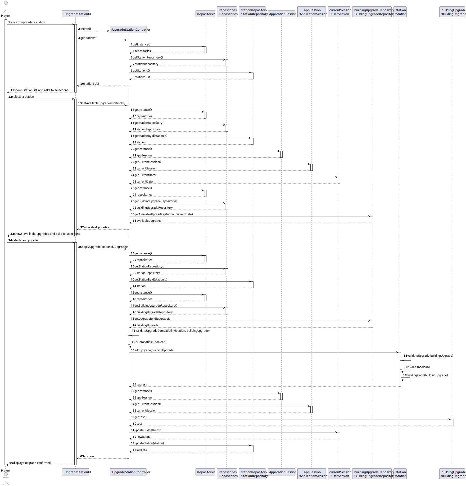
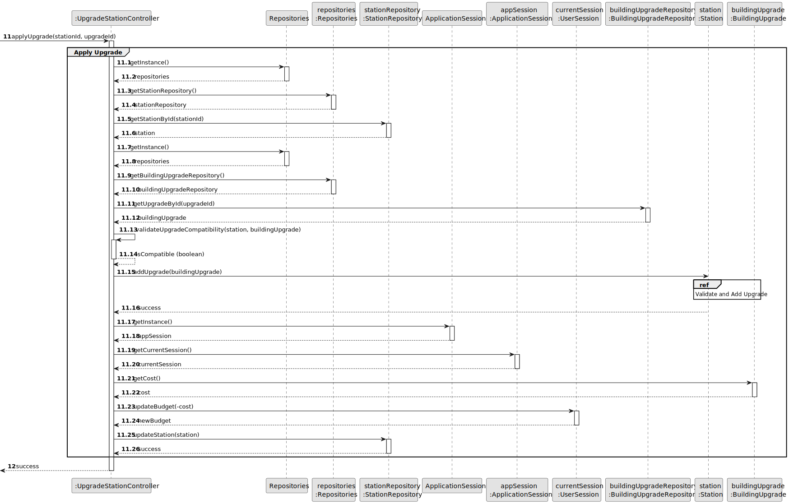
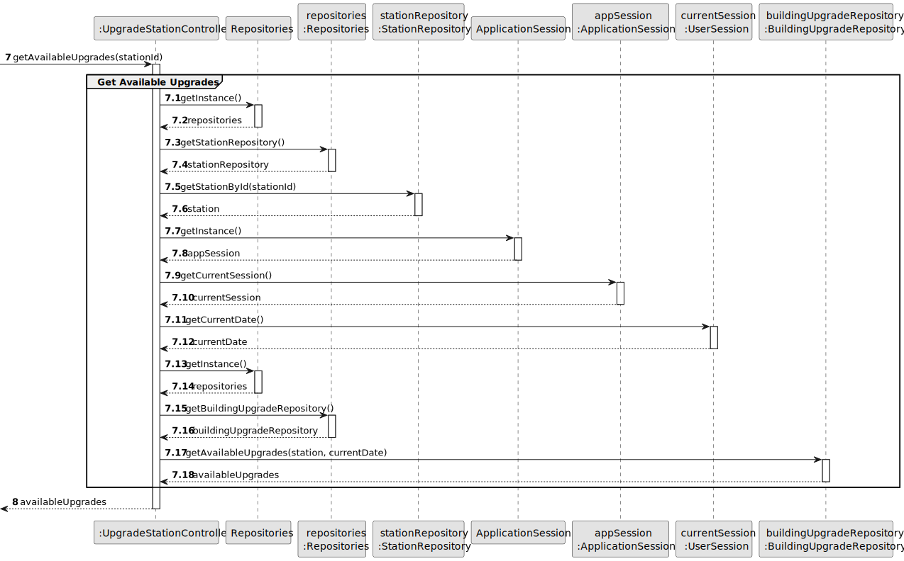
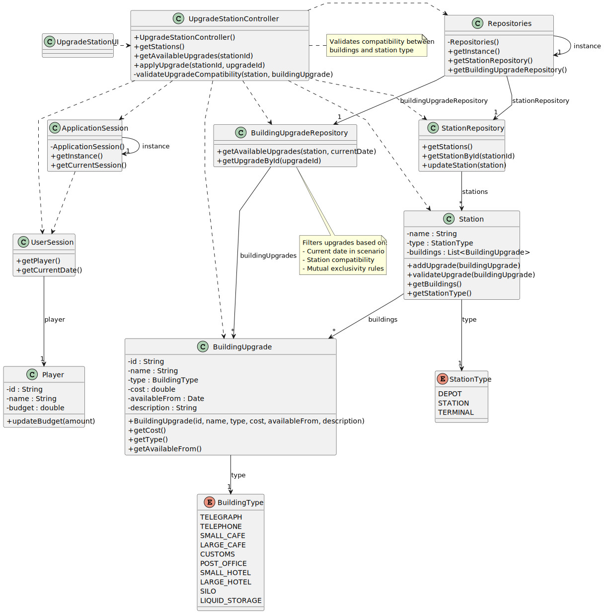

# US06 - As a Player, I want to upgrade a selected station with a building

## 3. Design

### 3.1. Rationale

| Interaction ID | Question: Which class is responsible for... | Answer                   | Justification (with patterns)                                                                                       |
|:---------------|:--------------------------------------------|:-------------------------|:--------------------------------------------------------------------------------------------------------------------|
| Step 1         | ... interacting with the actor?             | UpgradeStationUI         | Pure Fabrication: there is no reason to assign this responsibility to any existing class in the Domain Model.       |
|                | ... coordinating the US?                    | UpgradeStationController | Controller                                                                                                          |
| Step 2         | ... getting all stations?                   | StationRepository        | IE: StationRepository maintains all Stations.                                                                       |
|                | ... accessing the repository?               | Repositories             | Creator and IE: knows and maintains the repositories.                                                               |
| Step 3         | ... getting the current map?                | Repositories             | IE: Repositories maintains the current Map.                                                                         |
|                | ... knowing the current date?               | UserSession              | IE: knows the current game session date.                                                                            |
|                | ... getting the selected station?           | StationRepository        | IE: can find and return a station based on its ID.                                                                  |
| Step 4         | ... validating upgrade compatibility?       | UpgradeStationController | Controller: combines domain knowledge to determine if a building upgrade is compatible with the selected station.   |
| Step 5         | ... adding the upgrade to station?          | Station                  | IE: owns its list of buildings and can manage them.                                                                 |
|                | ... local validation of upgrade?            | Station                  | IE: has the domain knowledge to validate if an upgrade can be added (based on station type and existing buildings). |
| Step 6         | ... updating the player's budget?           | UserSession              | IE: has access to the current player and can update their budget.                                                   |              
|                | ... saving the updated station?             | Station                  | IE: responsible for storing and managing all stations.                                                              |
| Step 7         | ... informing operation success?            | UpgradeStationUI         | IE: is responsible for user interactions.                                                                           | 

### Systematization ##

According to the taken rationale, the conceptual classes promoted to software classes are:

* Station
* StationType
* BuildingUpgrade
* BuildingType
* Player

Other software classes (i.e. Pure Fabrication) identified:

* UpgradeStationUI
* UpgradeStationController
* Repositories
* StationRepository
* BuildingUpgradeRepository
* ApplicationSession
* UserSession

## 3.2. Sequence Diagram (SD)

### Full Diagram

This diagram shows the full sequence of interactions between the classes involved in the realization of this user story.

### Split Diagrams

The following diagram shows the same sequence of interactions between the classes involved in the realization of this user story, but it is split in partial diagrams to better illustrate the interactions between the classes.

It uses Interaction Occurrence (a.k.a. Interaction Use).

**Apply Station Upgrade Partial SD**

**Get Available Upgrades Partial SD**

**Get Station List Partial SD**

**Station Validate and add Upgrade Partial SD**

## 3.3. Class Diagram (CD)

