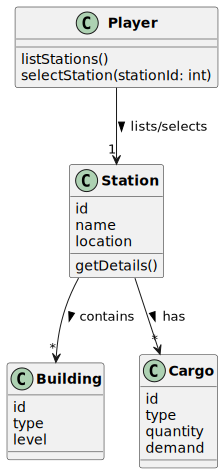

# US07 - As a Player, I want to list all the stations to select one to see its details, including the existing building and the demand/supply cargoes.
 
 ## 2. Analysis
 
 ### 2.1. Relevant Domain Model Excerpt 
 
 
 
 The domain model excerpt shows the following classes and their relationships:
 - **Player**: Can list available stations, can list available stations, can select a station to interact with.
 - **Station**: Represents a location with a unique id, name, and location, can provide detailed information. 
 - **Building**: Represents structures within a station, has a level indicating upgrades or capacity.
 - **Cargo**: Represents goods stored or needed at a station, tracks quantity and whether it is in demand.
 
 The relationships show that:
 - One Player → can interact with → multiple Stations
 
 - One Station → contains → multiple Buildings
 
 - One Station → stores → multiple Cargos
 
 
 ### 2.2. Other Remarks
 
 The diagram represents a system where a Player interacts with Stations, which contain Buildings and Cargos.
 
 - Player → Lists and selects Stations.
 - Station → Has an identifier, name and location. Can contain multiple Buildings and store different Cargos.
 - Building → Represents structures at the station, with type and level.
 - Cargo → Stores goods, indicating type, quantity and whether there is demand.