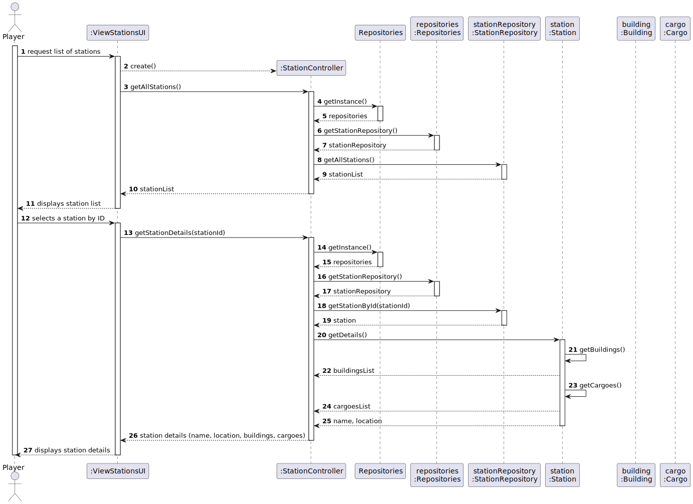
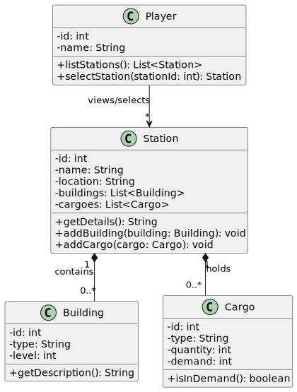

# US07 - As a Player, I want to list all the stations to select one to see its details, including the existing building and the demand/supply cargoes.

## 3. Design

### 3.1. Rationale

**The rationale grounds on the SSD interactions and the identified input/output data.**

| Interaction ID | Question: Which class is responsible for...                             | Answer              | Justification (with patterns)                          |
|----------------|------------------------------------------------------------------------|---------------------|--------------------------------------------------------|
| Step 1         | ...interacting with the player?                                         | `ViewStationsUI`    | **Pure Fabrication**: UI handles interaction with the user. |
| Step 2         | ...coordinating the use case?                                           | `StationController` | **Controller Pattern**: orchestrates the use case flow.     |
| Step 3         | ...retrieving the station repository singleton?                         | `Repositories`      | **Singleton Pattern**: central access point for repositories. |
| Step 4         | ...accessing the station repository from singleton?                     | `StationRepository` | **Repository Pattern**: responsible for retrieving domain objects. |
| Step 5         | ...returning the full list of stations?                                 | `StationRepository` | **Repository Pattern**: provides access to stored data. |
| Step 6         | ...displaying the list of stations to the user?                         | `ViewStationsUI`    | **Pure Fabrication**: the UI formats and shows the data. |
| Step 7         | ...requesting details of a specific station?                            | `ViewStationsUI`    | **Pure Fabrication**: user selection forwarded by UI. |
| Step 8         | ...retrieving a station by its ID?                                      | `StationRepository` | **Repository Pattern**: abstracts the persistence mechanism. |
| Step 9         | ...providing its name and location?                                     | `Station`           | **Information Expert**: owns its identifying attributes. |
| Step 10        | ...returning associated buildings?                                      | `Station`           | **Information Expert**: knows the structures it contains. |
| Step 11        | ...returning associated cargoes (with supply/demand)?                   | `Station`           | **Information Expert**: manages its related cargo. |
| Step 12        | ...returning building type and level?                                   | `Building`          | **Information Expert**: encapsulates its own attributes. |
| Step 13        | ...returning cargo type, quantity, and demand?                          | `Cargo`             | **Information Expert**: encapsulates cargo-specific logic. |

### Systematization ##

According to the taken rationale, the conceptual classes promoted to software classes are:

* Player 
* Station
* Building
* Cargo

Other software classes (i.e. Pure Fabrication) identified:

## 3.2. Sequence Diagram (SD)

## 3.3. Class Diagram (CD)

