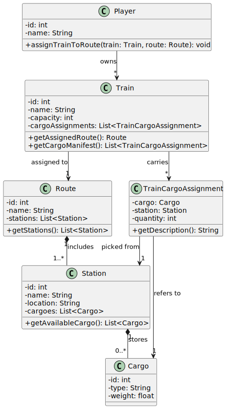

# US10 - As a Player, I want to assign a selected train to a route with valid stations and the respective list of cargoes to be picked up in each station.

### 3.1. Rationale

**The rationale grounds on the SSD interactions and the identified input/output data.**

| Interaction ID | Question: Which class is responsible for...   | Answer   | Justification (withpatterns)   ||----------------|------------------------------------------------------------------------|----------------------|--------------------------------------------------------|
| Step 1         | ...interacting with the player?                                         | `AssignTrainUI`      | **Pure Fabrication**: UI handles interaction with the user for assigning a train. |
| Step 2         | ...coordinating the use case?                                           | `TrainAssignmentController` | **Controller Pattern**: orchestrates the use case flow and manages train assignment logic. |
| Step 3         | ...retrieving the train repository singleton?                           | `Repositories`       | **Singleton Pattern**: central access point for repositories. |
| Step 4         | ...accessing the train repository from singleton?                       | `TrainRepository`    | **Repository Pattern**: responsible for retrieving domain objects related to trains. |
| Step 5         | ...retrieving the list of available trains?                             | `TrainRepository`    | **Repository Pattern**: provides access to the list of available trains. |
| Step 6         | ...displaying the list of trains to the user?                           | `AssignTrainUI`      | **Pure Fabrication**: the UI formats and shows the data to the user. |
| Step 7         | ...requesting details of a specific train?                              | `AssignTrainUI`      | **Pure Fabrication**: user selection forwarded by UI. |
| Step 8         | ...retrieving a train by its ID?                                        | `TrainRepository`    | **Repository Pattern**: abstracts the persistence mechanism and fetches the train. |
| Step 9         | ...retrieving the route details?                                       | `RouteRepository`    | **Repository Pattern**: responsible for retrieving the route details for assignment. |
| Step 10        | ...returning the available stations for the route?                      | `Route`              | **Information Expert**: owns the list of stations included in the route. |
| Step 11        | ...returning the available cargoes at each station?                     | `Station`            | **Information Expert**: manages the cargoes stored at each station. |
| Step 12        | ...assigning cargoes to the train?                                      | `Train`              | **Information Expert**: the train is responsible for managing and assigning the cargoes to its load. |
| Step 13        | ...finalizing the train and route assignment?                           | `TrainAssignmentController` | **Controller Pattern**: handles the final assignment of the train to the route and its cargoes. |

### Systematization ##

According to the taken rationale, the conceptual classes promoted to software classes are:

* Train
* Route
* Station
* Cargo

Other software classes (i.e. Pure Fabrication) identified:

* AssignTrainUI  
* TrainAssignmentController
* TrainRepository
* RouteRepository
* StationRepository
* CargoRepository

## 3.2. Sequence Diagram (SD)

## 3.3. Class Diagram (CD)

