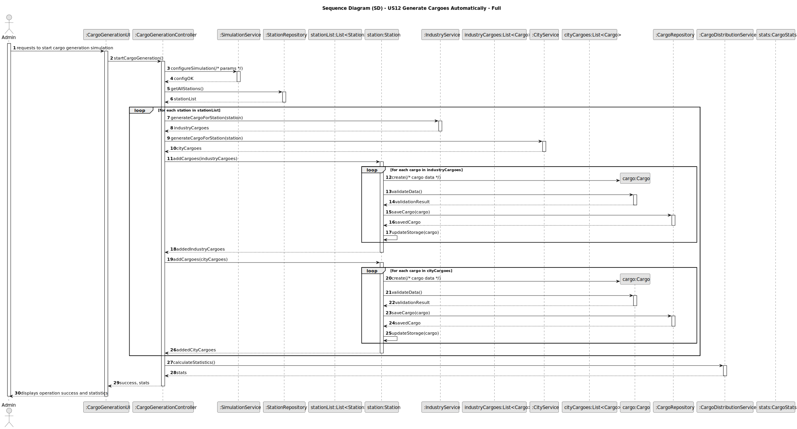
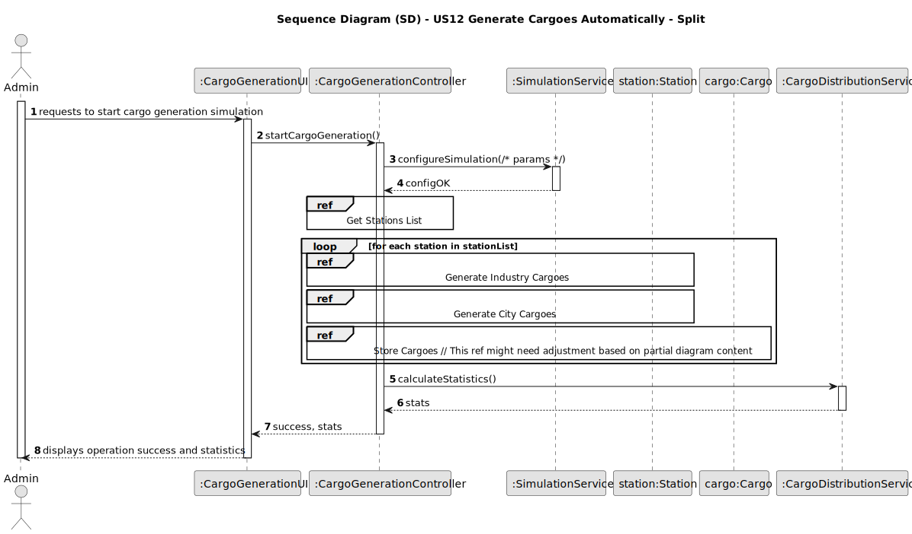
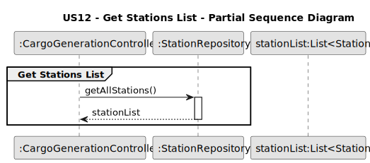
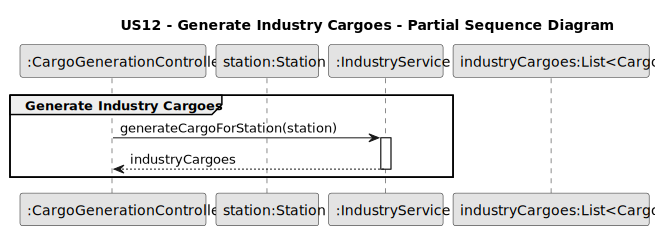
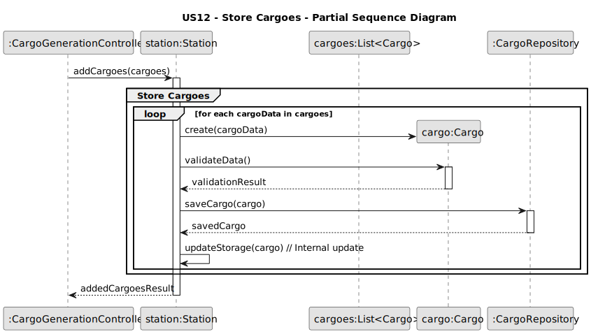
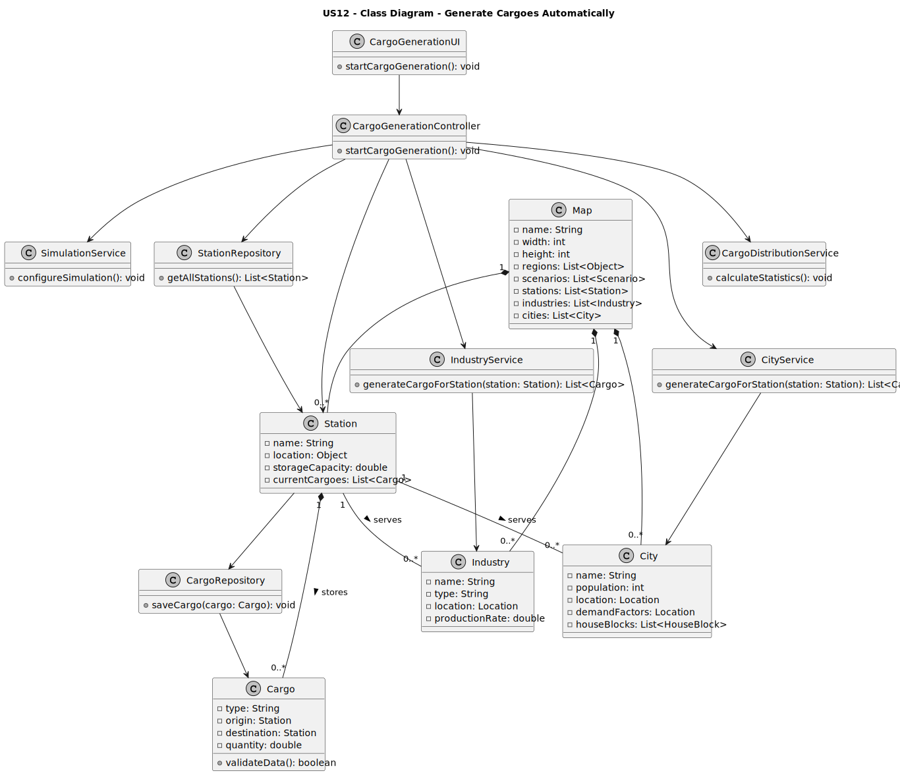

# US12 - Generate Cargoes Automatically at Stations

## 3. Design

### 3.1. Rationale

| Interaction ID | Question: Which class is responsible for...     | Answer                    | Justification (with patterns)                                                                                 |
|:---------------|:------------------------------------------------|:--------------------------|:--------------------------------------------------------------------------------------------------------------|
| Step 1         | ... interacting with the actor?                 | CargoGenerationUI         | Pure Fabrication: there is no reason to assign this responsibility to any existing class in the Domain Model. |
|                | ... coordinating the US?                        | CargoGenerationController | Controller                                                                                                    |
| Step 2         | ... controlling the simulation parameters?      | SimulationService         | Pure Fabrication: encapsulates the simulation rules and processes.                                            |
| Step 3         | ... knowing all existing stations to process?   | StationRepository         | IE: Stations are maintained in the repository.                                                                |
| Step 4         | ... determining cargo production at industries? | IndustryService           | Pure Fabrication: service for calculating industry production.                                                |
| Step 5         | ... determining cargo demand at cities?         | CityService               | Pure Fabrication: service for calculating city demand.                                                        |
| Step 6         | ... creating cargo instances?                   | Station                   | Creator: Station has cargoes in the domain model.                                                             |
|                | ... validating cargo data?                      | Cargo                     | IE: owns its data.                                                                                            |
| Step 7         | ... storing generated cargoes?                  | CargoRepository           | IE: responsible for persisting cargoes.                                                                       | 
| Step 8         | ... updating station storage information?       | Station                   | IE: knows its own data (available storage).                                                                   |
| Step 9         | ... calculating cargo distribution statistics?  | CargoDistributionService  | Pure Fabrication: responsible for statistical analysis of cargo distribution.                                 |
| Step 10        | ... informing operation success?                | CargoGenerationUI         | IE: is responsible for user interactions.                                                                     | 

### Systematization ##

According to the taken rationale, the conceptual classes promoted to software classes are: 

* Station
* Industry
* City
* Cargo
* Map

Other software classes (i.e. Pure Fabrication) identified: 

* CargoGenerationUI  
* CargoGenerationController
* SimulationService
* IndustryService
* CityService
* CargoDistributionService
* StationRepository
* IndustryRepository
* CityRepository
* CargoRepository

## 3.2. Sequence Diagram (SD)

### Full Diagram

This diagram shows the full sequence of interactions between the classes involved in the realization of this user story.

### Split Diagrams

The following diagram shows the same sequence of interactions between the classes involved in the realization of this user story, but it is split in partial diagrams to better illustrate the interactions between the classes.

It uses Interaction Occurrence (a.k.a. Interaction Use).

**Get Stations List Partial SD**

**Generate Industry Cargoes Partial SD**

**Generate City Cargoes Partial SD**

**Store Cargoes Partial SD**

## 3.3. Class Diagram (CD)

