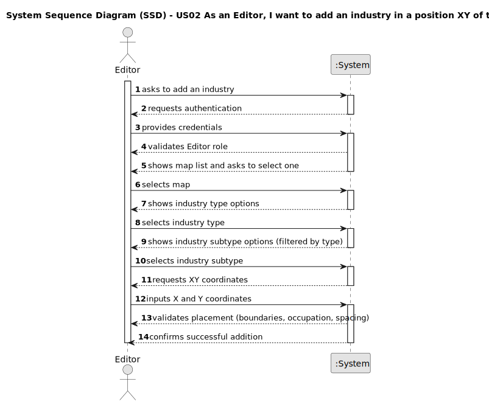

# US02 - As an Editor, I want to add an industry in a position XY of the selected map.

## 1. Requirements Engineering

### 1.1. User Story Description

As an Editor, I want to add an industry (selected from the available industries) in a position XY of the selected (current) map.

### 1.2. Customer Specifications and Clarifications 

**From the specifications document:**

> There are three different types of industries:
> 1. **Primary sector industries** - which generate resources, such as mines (e.g., iron, coal, bauxite, or nitrate mines) and farms (vegetables, cereals, wool, coffee, rubber, cattle).
> 2. **Transforming industries** - which transform the resources provided by the Primary Sector Industries into new products. This industry includes bakeries, textiles, automobiles, and steel mills.
> 3. **Mixed industries** - Ports potentially have the capacity, depending on what is defined in the scenario, to import/export and transform any cargo.

**From the client clarifications:**

> **Question:** Can multiple industries be placed at the same coordinates?
>
> **Answer:** No, each position can only contain one element (industry, city, or station).

> **Question:** Are there restrictions on industry placement relative to other map elements?
>
> **Answer:** Industries must maintain a minimum distance of 1 cell from other elements to prevent overcrowding.

> **Question:** What happens if an Editor tries to place an industry outside map boundaries?
>
> **Answer:** The system should validate coordinates and reject placements outside valid map area.

### 1.3. Acceptance Criteria

* **AC01:** It must be possible to add all three types of industries (primary, transforming, and mixed).
* **AC02:** An industry must be placed at a valid XY position within the map boundaries.
* **AC03:** Industries must maintain a minimum distance of 1 cell from other map elements.
* **AC04:** The system must validate that the selected position is not already occupied.
* **AC05:** Only authenticated users with "Editor" role can add industries.
* **AC06:** Each industry subtype must have clear specifications of what resources it generates or consumes.

### 1.4. Found out Dependencies

* **US01** - A map must be created before an industry can be added to it.
* **US04** - Scenarios define which industry types are available for placement.
* **US12** - Industries will be used for automatic cargo generation in the simulator.

### 1.5. Input and Output Data

**Input Data:**

* Selected data:
    * map (from available maps list)
    * industry type (Primary, Transforming, Mixed)
    * industry subtype (depends on selected type)
    
* Typed data:
    * X coordinate
    * Y coordinate

**Output Data:**

* List of available maps
* List of industry types
* List of industry subtypes (filtered by selected type)
* Success/failure message with validation details
* Updated map visualization with the industry placed

### 1.6. System Sequence Diagram (SSD)

**_Other alternatives might exist._**

### 1.7. Other Relevant Remarks

* Industries are static elements that remain at fixed positions once placed.
* Industry placement is a fundamental map editing operation that will be used frequently.
* Industries only participate in cargo generation/consumption if served by a station (US05).
* The system must ensure data integrity by preventing overlapping placements.