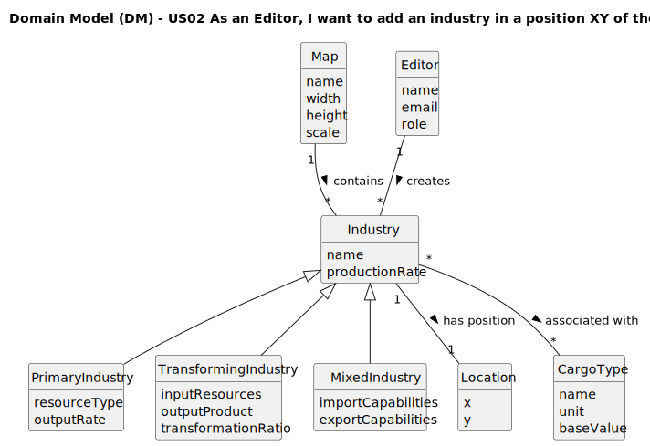

# US02 - As an Editor, I want to add an industry in a position XY of the selected map.

## 2. Analysis

### 2.1. Relevant Domain Model Excerpt

### 2.2. Other Remarks

From the analysis, we can observe that:

1. **Industry Hierarchy**: The system supports three distinct industry types through inheritance:
  - **PrimaryIndustry**: Generates raw resources (mines, farms)
  - **TransformingIndustry**: Processes resources into products (factories, mills)
  - **MixedIndustry**: Flexible import/export capabilities (ports)

2. **Spatial Relationships**: Each industry has a precise location on the map, represented by XY coordinates. The Location class encapsulates position logic and validation.

3. **Map Constraints**: The Map acts as a container that enforces spatial rules:
  - Boundary validation (coordinates within map dimensions)
  - Occupation validation (no overlapping elements)
  - Spacing validation (minimum distance between elements)

4. **Cargo Associations**: Industries are associated with specific CargoType objects that define:
  - Input resources (for transforming industries)
  - Output products (for all production industries)
  - Import/export capabilities (for mixed industries)

5. **Editor Privileges**: Only authenticated users with Editor role can modify map content, ensuring proper authorization control.

6. **Data Integrity**: The system maintains referential integrity between maps and their contained industries, preventing orphaned or invalid industry references.

The domain model supports extensibility for future industry types while maintaining clear separation of concerns between spatial management (Map, Location) and industry-specific behavior (Industry hierarchy).