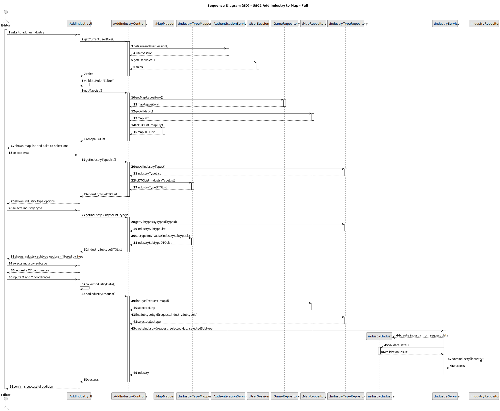
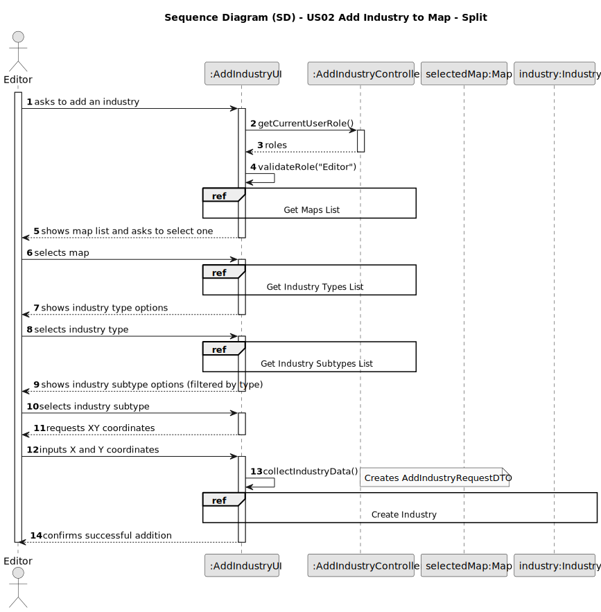
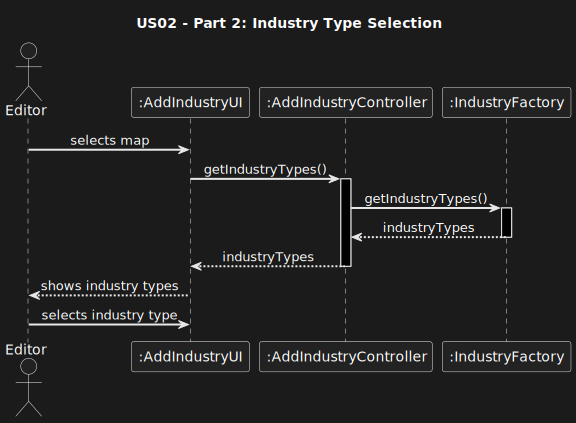
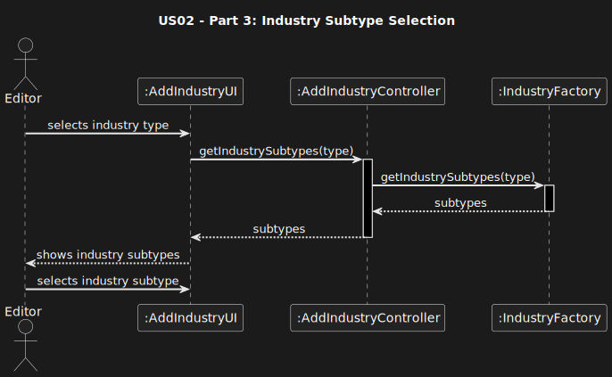
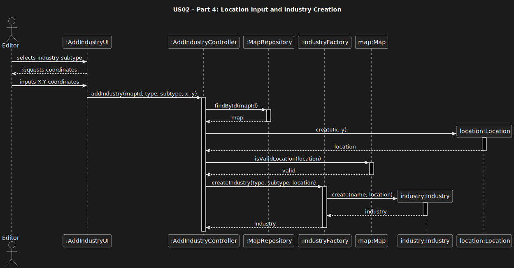
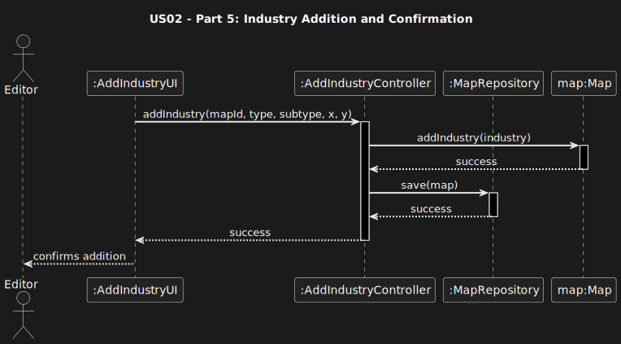
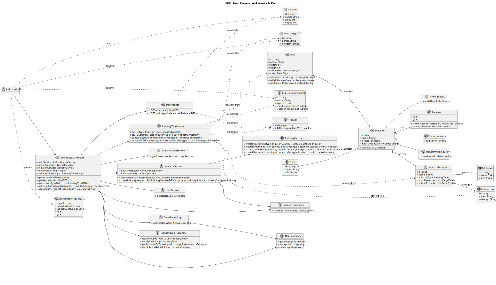

# US02 - As an Editor, I want to add an industry in a position XY of the selected map.

## 3. Design

### 3.1. Rationale

| Interaction ID | Question: Which class is responsible for... | Answer | Justification (with patterns) |
|:---------------|:---------------------------------------------|:-------|:------------------------------|
| Step 1 | ...interacting with the actor? | AddIndustryUI | Pure Fabrication: there is no reason to assign this responsibility to any existing class in the Domain Model. |
| | ...coordinating the US? | AddIndustryController | Controller |
| | ...knowing the user using the system? | AuthenticationService | IE: cf. A&A component documentation. |
| | | UserSession | IE: knows/has the currently logged in user |
| | | Editor | IE: knows its own data (e.g. role) |
| Step 2 | ...knowing all existing maps to show? | MapRepository | IE: Maps are accessed through the repository. |
| | | GameRepository | By applying High Cohesion (HC) + Low Coupling (LC), it delegates the responsibility to the MapRepository. |
| Step 3 | ...saving the selected map? | AddIndustryUI | IE: is responsible for keeping the selected map. |
| Step 4 | ...knowing all industry types? | IndustryTypeRepository | IE: Industry types are accessed through the repository. |
| | ...converting domain to DTO? | IndustryTypeMapper | Pure Fabrication: responsible for domain ↔ DTO conversion |
| Step 5 | ...saving selected industry type? | AddIndustryUI | IE: is responsible for keeping the selected industry type. |
| Step 6 | ...knowing industry subtypes for a type? | IndustryTypeRepository | IE: knows relationships between types and subtypes. |
| | ...filtering subtypes by type? | IndustryService | Pure Fabrication: encapsulates business logic for industry operations |
| Step 7 | ...saving selected industry subtype? | AddIndustryUI | IE: is responsible for keeping the selected subtype. |
| Step 8 | ...requesting XY coordinates? | AddIndustryUI | IE: is responsible for user interactions. |
| Step 9 | ...instantiating a new Industry? | IndustryFactory | Creator (Rule 4): IndustryFactory creates different industry types. |
| | ...validating all data (local validation)? | Industry | IE: owns its data. |
| | ...validating all data (global validation)? | IndustryService | IE: knows the rules for industry placement. |
| | ...validating location constraints? | Map | IE: knows its dimensions and existing elements. |
| | ...saving the created industry? | IndustryRepository | IE: responsible for persisting industries. |
| | ...adding industry to map? | Map | IE: knows about its industries (High Cohesion). |
| Step 10 | ...informing operation success? | AddIndustryUI | IE: is responsible for user interactions. |

### Systematization

According to the taken rationale, the conceptual classes promoted to software classes are:

- Map
- Industry (and its subclasses: PrimaryIndustry, TransformingIndustry, MixedIndustry)
- Location
- CargoType
- Editor

Other software classes (i.e. Pure Fabrication) identified:

- AddIndustryUI
- AddIndustryController
- GameRepository
- MapRepository
- IndustryRepository
- IndustryTypeRepository
- IndustryService
- IndustryFactory
- IndustryTypeMapper
- AuthenticationService
- UserSession

## 3.2. Sequence Diagram (SD)

### Full Diagram

This diagram shows the full sequence of interactions between the classes involved in the realization of this user story.

### Split Diagrams

The following diagram shows the same sequence of interactions between the classes involved in the realization of this user story, but it is split in partial diagrams to better illustrate the interactions between the classes.

It uses Interaction Occurrence (a.k.a. Interaction Use).

**Get Maps List Partial SD**

**Get Industry Types List Partial SD**

**Get Industry Subtypes List Partial SD**

**Create Industry Partial SD**

## 3.3. Class Diagram (CD)

