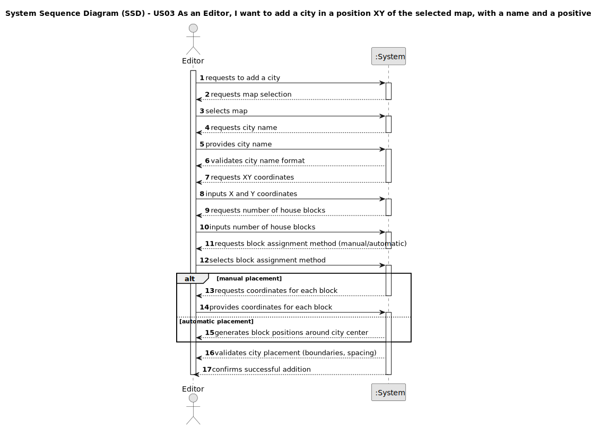

# US03 - As an Editor, I want to add a city in a position XY of the selected map, with a name and a positive number of house blocks.

## 1. Requirements Engineering

### 1.1. User Story Description

As an Editor, I want to add a city in a position XY of the selected map, with a name and a positive number of house blocks.

### 1.2. Customer Specifications and Clarifications 

**From the specifications document:**

> A city bears a name, a location (with XY coordinates on the map), and a set of blocks that represent housing. In the simulator's context, cities generate and consume passengers, and mail, but they also consume final products (e.g., food, textiles, cars).

**From the client clarifications:**

> **Question:** What are the rules for city name validation?
>
> **Answer:** City names cannot contain special characters or digits, and must be unique within each map.

> **Question:** How should house blocks be distributed when using automatic placement?
>
> **Answer:** House blocks should be randomly distributed around the city center using normal distribution, maintaining minimum spacing.

> **Question:** What is the minimum spacing required between house blocks?
>
> **Answer:** House blocks must maintain at least 1 cell distance from each other and from other map elements.

### 1.3. Acceptance Criteria

* **AC01:** A city name cannot have special characters or digits.
* **AC02:** The house blocks can be assigned manually or automatically (randomly around the city tag position according to normal distribution).
* **AC03:** The number of house blocks must be positive and greater than zero.
* **AC04:** Each city must have a unique name within the map.
* **AC05:** City must be placed at valid XY coordinates within map boundaries.
* **AC06:** House blocks must maintain minimum spacing from each other and other map elements.
* **AC07:** Only authenticated users with "Editor" role can add cities.

### 1.4. Found out Dependencies

* **US01** - A map must be created before a city can be added to it.
* **US04** - Scenarios may define population growth factors that affect city development.
* **US12** - City size will impact passenger, mail, and product demand in cargo generation.

### 1.5. Input and Output Data

**Input Data:**

* Selected data:
    * map (from available maps list)
    * block assignment method (manual or automatic)
    * if manual: coordinates for each house block
    
* Typed data:
    * city name
    * X coordinate (city center)
    * Y coordinate (city center)
    * number of house blocks

**Output Data:**

* List of available maps
* Success/failure message with validation details
* Updated map visualization with the city and house blocks placed
* City population summary based on house blocks

### 1.6. System Sequence Diagram (SSD)

**_Other alternatives might exist._**

### 1.7. Other Relevant Remarks

* Cities are static elements that remain at fixed positions once placed.
* The automatic block placement algorithm uses normal distribution for realistic urban spread.
* Cities interact with the railway network only through stations (US05).
* Population size directly correlates with cargo demand in simulation (US12).
* The system must ensure spatial integrity by preventing overlapping elements.