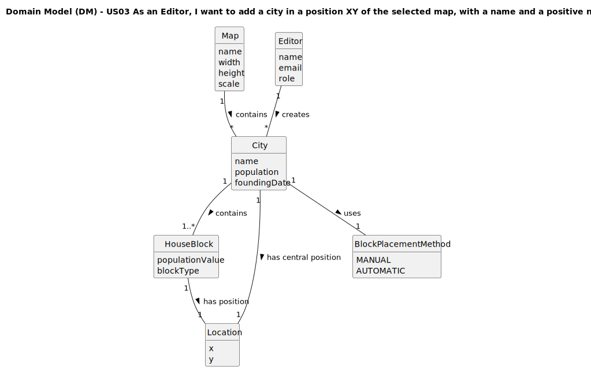

# US03 - As an Editor, I want to add a city in a position XY of the selected map, with a name and a positive number of house blocks.

## 2. Analysis

### 2.1. Relevant Domain Model Excerpt 

### 2.2. Other Remarks

From the analysis, we can observe that:

1. **City Structure**: The system models cities as complex entities composed of:
   - **Central Location**: Primary coordinates defining the city's position on the map
   - **Name**: Unique identifier within each map, subject to validation rules
   - **House Blocks**: Collection of residential units that determine population and cargo demand

2. **Spatial Relationships**: Each city maintains precise spatial control through:
   - **City Location**: Central coordinates for the city tag/center
   - **Block Locations**: Individual coordinates for each house block
   - **Spacing Constraints**: Minimum distance requirements between blocks and other elements

3. **Population Dynamics**: The relationship between house blocks and population affects:
   - **Passenger Generation**: More blocks = higher passenger demand
   - **Mail Volume**: Population size influences mail traffic
   - **Product Consumption**: Cities consume final products based on population

4. **Placement Strategies**: The system supports flexible block placement through:
   - **Manual Placement**: Editor specifies exact coordinates for each block
   - **Automatic Placement**: Algorithm distributes blocks using normal distribution around city center
   - **Validation**: Both methods ensure spatial constraints are met

5. **Map Integration**: Cities integrate with the broader map ecosystem:
   - **Boundary Validation**: All city elements must remain within map dimensions
   - **Element Coordination**: Cities coexist with industries and stations
   - **Uniqueness**: City names must be unique within each map context

6. **Editor Privileges**: Similar to industries, only authenticated editors can create cities, ensuring proper content control and maintaining map integrity.

7. **Future Extensibility**: The design supports future enhancements such as:
   - Different house block types (residential, commercial)
   - City growth over time in scenarios
   - Advanced population dynamics
   - Integration with economic simulation systems

The domain model emphasizes the dual nature of cities as both simple location markers and complex population centers, providing flexibility for current functionality while supporting future simulation requirements.