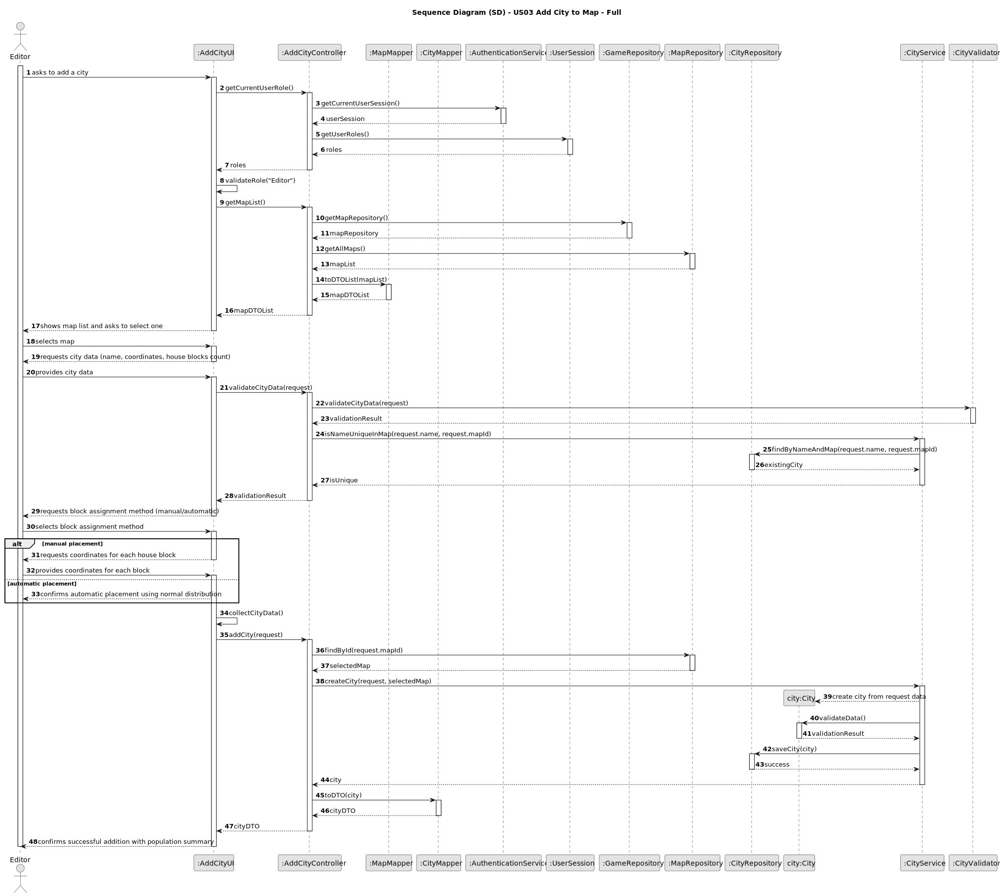
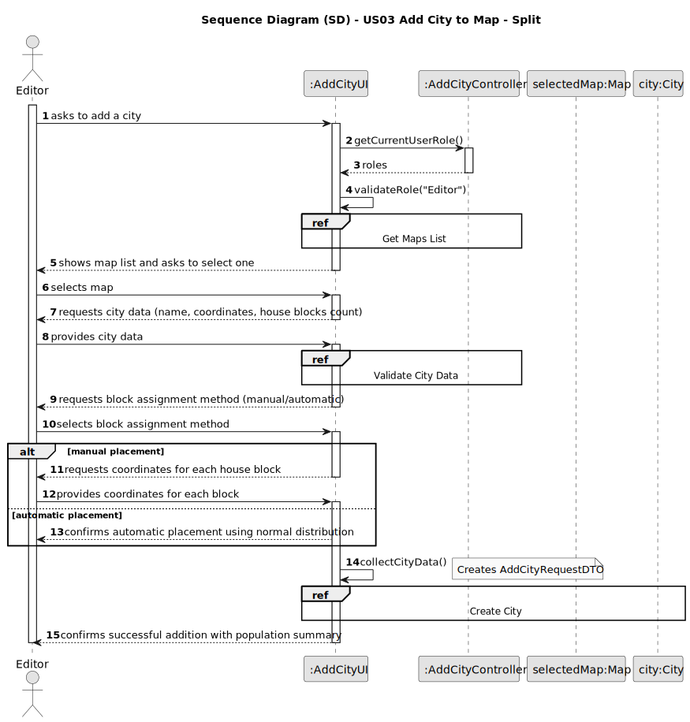
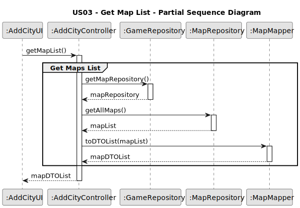
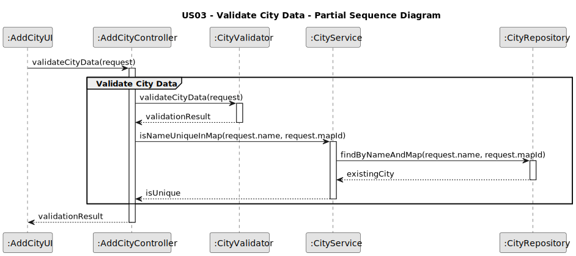
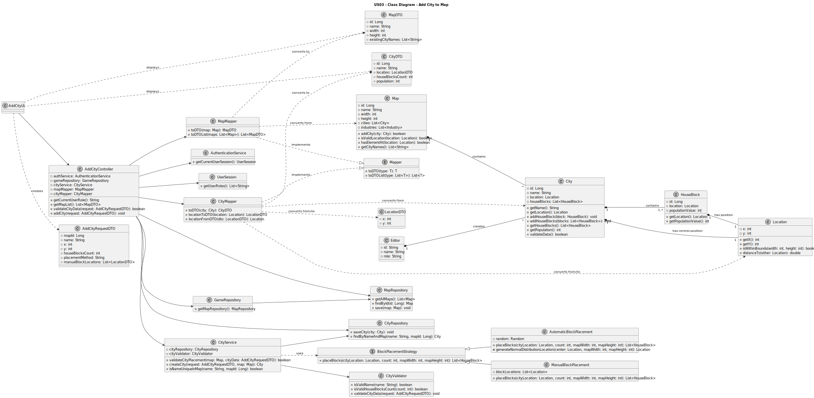

# US03 - As an Editor, I want to add a city in a position XY of the selected map, with a name and a positive number of house blocks.

## 3. Design

### 3.1. Rationale

| Interaction ID | Question: Which class is responsible for... | Answer | Justification (with patterns) |
|:---------------|:---------------------------------------------|:-------|:------------------------------|
| Step 1 | ...interacting with the actor? | AddCityUI | Pure Fabrication: there is no reason to assign this responsibility to any existing class in the Domain Model. |
| | ...coordinating the US? | AddCityController | Controller |
| | ...knowing the user using the system? | AuthenticationService | IE: cf. A&A component documentation. |
| | | UserSession | IE: knows/has the currently logged in user |
| | | Editor | IE: knows its own data (e.g. role) |
| Step 2 | ...knowing all existing maps to show? | MapRepository | IE: Maps are accessed through the repository. |
| | | GameRepository | By applying High Cohesion (HC) + Low Coupling (LC), it delegates the responsibility to the MapRepository. |
| | ...converting domain to DTO? | MapMapper | Pure Fabrication: responsible for domain ↔ DTO conversion |
| Step 3 | ...saving the selected map? | AddCityUI | IE: is responsible for keeping the selected map. |
| Step 4 | ...requesting city data? | AddCityUI | IE: is responsible for user interactions. |
| Step 5 | ...validating city name format? | CityValidator | Pure Fabrication: encapsulates validation rules |
| | ...checking city name uniqueness? | CityService | Pure Fabrication: encapsulates business logic for city operations |
| Step 6 | ...requesting block assignment method? | AddCityUI | IE: is responsible for user interactions. |
| Step 7 | ...handling block placement strategy? | BlockPlacementStrategy | Strategy Pattern: encapsulates placement algorithms |
| | ...creating automatic placement? | AutomaticBlockPlacement | Strategy Pattern: concrete implementation for automatic placement |
| | ...creating manual placement? | ManualBlockPlacement | Strategy Pattern: concrete implementation for manual placement |
| Step 8 | ...instantiating a new City? | City | Creator (Rule 1): City creates itself with provided data |
| | ...creating house blocks? | HouseBlock | Creator (Rule 1): HouseBlock creates itself |
| | ...validating all data (local validation)? | City | IE: owns its data. |
| | ...validating all data (global validation)? | CityService | IE: knows the rules for city creation. |
| | ...validating location constraints? | Map | IE: knows its dimensions and existing elements. |
| | ...saving the created city? | CityRepository | IE: responsible for persisting cities. |
| | ...adding city to map? | Map | IE: knows about its cities (High Cohesion). |
| Step 9 | ...informing operation success? | AddCityUI | IE: is responsible for user interactions. |

### Systematization

According to the taken rationale, the conceptual classes promoted to software classes are:

- Map
- City
- Location
- HouseBlock
- Editor

Other software classes (i.e. Pure Fabrication) identified:

- AddCityUI
- AddCityController
- GameRepository
- MapRepository
- CityRepository
- CityService
- CityValidator
- BlockPlacementStrategy
- AutomaticBlockPlacement
- ManualBlockPlacement
- MapMapper
- CityMapper
- AuthenticationService
- UserSession

## 3.2. Sequence Diagram (SD)

### Full Diagram

This diagram shows the full sequence of interactions between the classes involved in the realization of this user story.

### Split Diagrams

The following diagram shows the same sequence of interactions between the classes involved in the realization of this user story, but it is split in partial diagrams to better illustrate the interactions between the classes.

It uses Interaction Occurrence (a.k.a. Interaction Use).

**Get Maps List Partial SD**

**Validate City Data Partial SD**

**Create City Partial SD**

## 3.2. Sequence Diagram (SD)

### Full Diagram

This diagram shows the full sequence of interactions between the classes involved in the realization of this user story.

### Split Diagrams

The following diagram shows the same sequence of interactions between the classes involved in the realization of this user story, but it is split in partial diagrams to better illustrate the interactions between the classes.

It uses Interaction Occurrence (a.k.a. Interaction Use).

**Get Maps List Partial SD**

**Validate City Data Partial SD**

**Create City Partial SD**

## 3.3. Class Diagram (CD)

