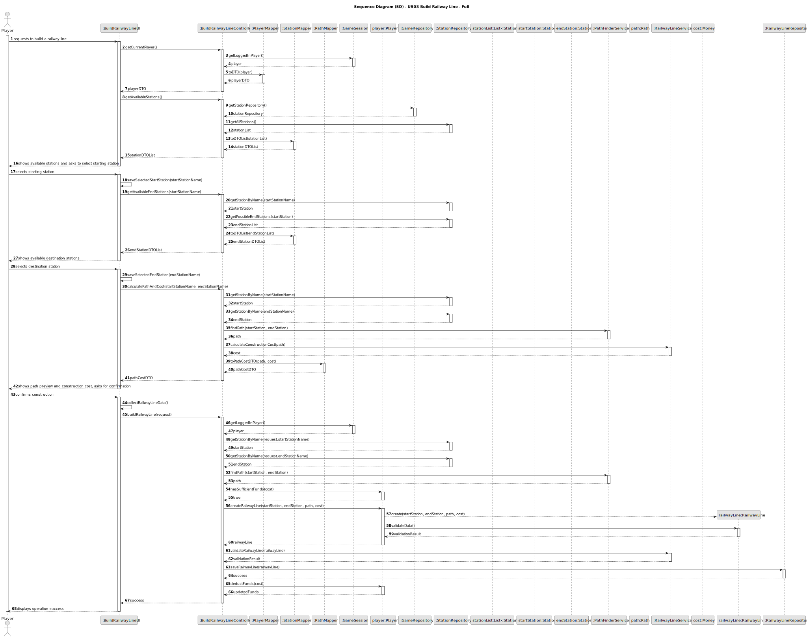
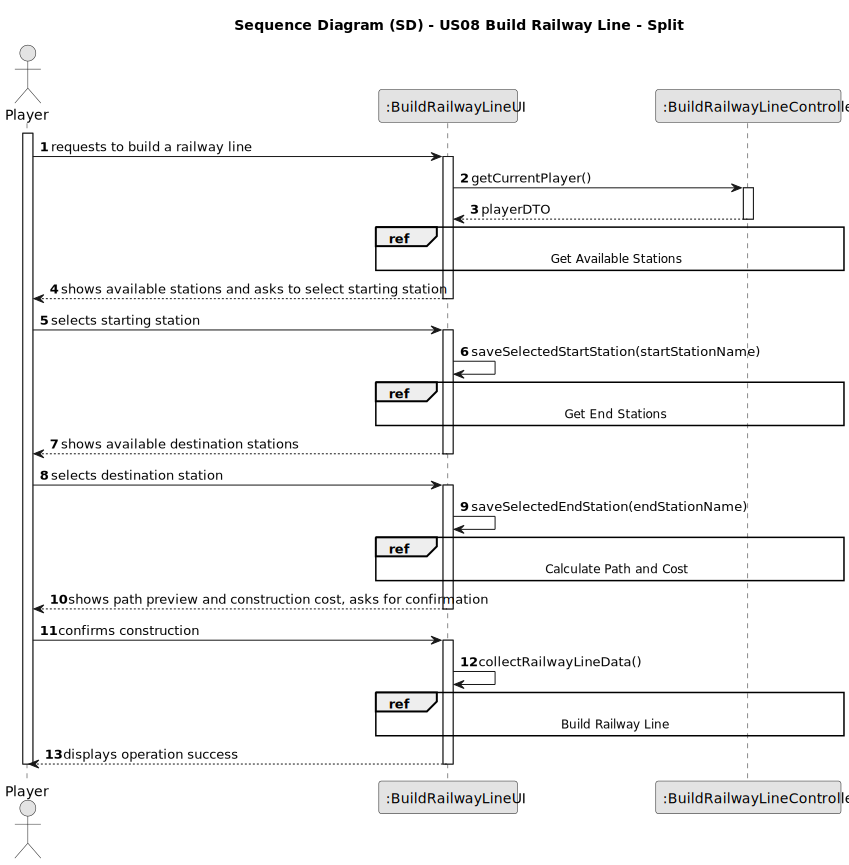
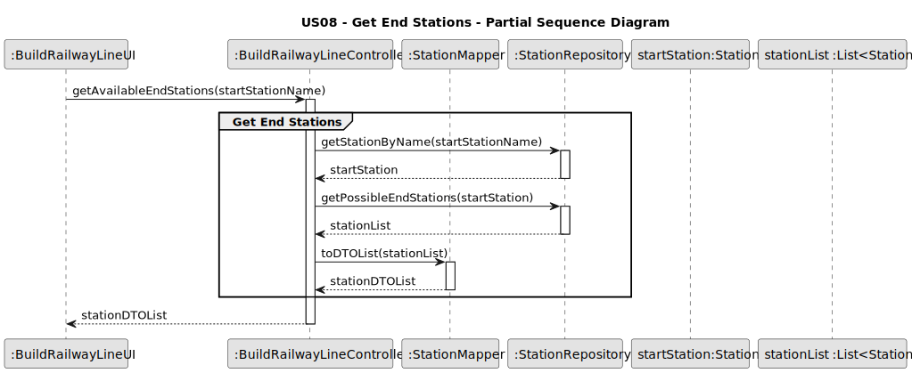
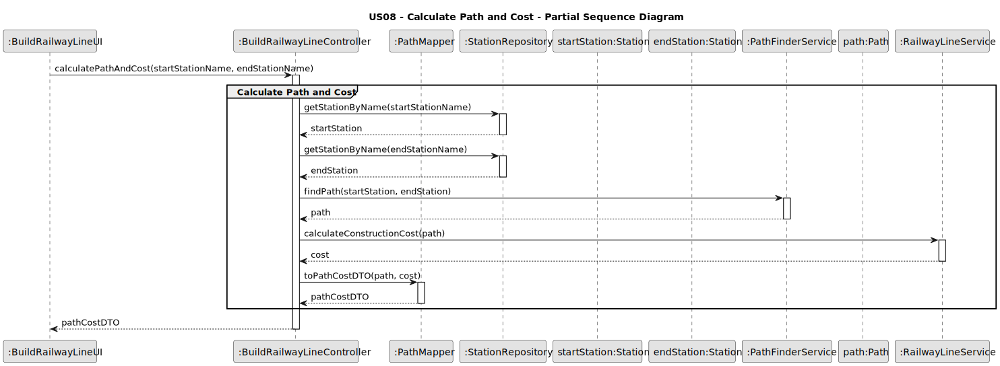
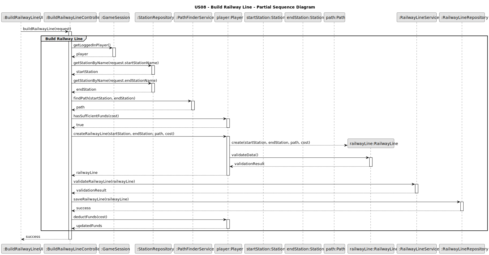
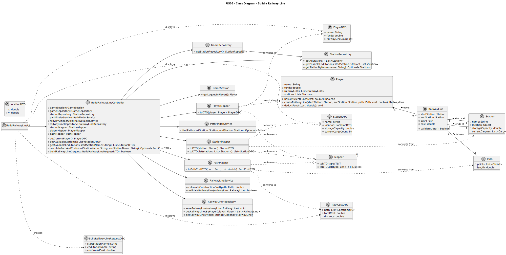

# US08 - Build a Railway Line Between Two Stations

## 3. Design

### 3.1. Rationale

| Interaction ID | Question: Which class is responsible for...        | Answer                  | Justification (with patterns)                                                                                                       |
|:---------------|:---------------------------------------------------|:------------------------|:------------------------------------------------------------------------------------------------------------------------------------|
| Step 1         | ... interacting with the actor?                    | BuildRailwayLineUI      | Pure Fabrication: there is no reason to assign this responsibility to any existing class in the Domain Model.                       |
|                | ... coordinating the US?                           | BuildRailwayLineController | Controller                                                                                                                        |
|                | ... knowing the user using the system?             | GameSession             | IE: cf. Game session component documentation.                                                                                      |
|                |                                                    | Player                  | IE: knows/has its own data (e.g. available funds)                                                                                  |
| Step 2         | ... knowing all existing stations to show?         | StationRepository       | IE: Stations are maintained in the repository.                                                                                     |
|                |                                                    | GameRepository          | By applying High Cohesion (HC) + Low Coupling (LC), it delegates the responsibility to the StationRepository.                       |
| Step 3         | ... saving the selected start station?             | BuildRailwayLineUI      | IE: is responsible for keeping the selected start station.                                                                         |
| Step 4         | ... knowing all available endpoint stations?       | StationRepository       | IE: Repositories maintain Station information.                                                                                     |
| Step 5         | ... saving the selected end station?               | BuildRailwayLineUI      | IE: is responsible for keeping the selected end station.                                                                           |
| Step 6         | ... requesting railway line options?               | BuildRailwayLineUI      | IE: is responsible for user interactions.                                                                                           |
| Step 7         | ... calculating the path and construction cost?    | PathFinderService       | Pure Fabrication: Service for path calculation between stations.                                                                   |
|                |                                                    | RailwayLineService      | Pure Fabrication: Service for cost calculation and validation.                                                                      |
| Step 8         | ... showing preview and requesting confirmation?   | BuildRailwayLineUI      | IE: is responsible for user interactions.                                                                                           |              
| Step 9         | ... verifying player funds?                        | Player                  | IE: knows its own funds.                                                                                                            |
| Step 10        | ... instantiating a new RailwayLine?               | Player                  | Creator (Rule 1): in the DM Player owns RailwayLines.                                                                              |
|                | ... validating all data (local validation)?        | RailwayLine             | IE: owns its data.                                                                                                                  | 
|                | ... validating all data (global validation)?       | RailwayLineService      | IE: knows rules for railway lines (e.g., no overlapping).                                                                           | 
|                | ... saving the created railway line?               | RailwayLineRepository   | IE: responsible for persisting railway lines.                                                                                      | 
| Step 11        | ... updating player funds?                         | Player                  | IE: knows its own data (e.g. funds).                                                                                                |
| Step 12        | ... informing operation success?                   | BuildRailwayLineUI      | IE: is responsible for user interactions.                                                                                           | 

### Systematization ##

According to the taken rationale, the conceptual classes promoted to software classes are: 

* Player
* RailwayLine
* Station
* Path
* Map

Other software classes (i.e. Pure Fabrication) identified: 

* BuildRailwayLineUI  
* BuildRailwayLineController
* GameRepository
* StationRepository
* RailwayLineRepository
* PathFinderService
* RailwayLineService
* GameSession

## 3.2. Sequence Diagram (SD)

### Full Diagram

This diagram shows the full sequence of interactions between the classes involved in the realization of this user story.

### Split Diagrams

The following diagram shows the same sequence of interactions between the classes involved in the realization of this user story, but it is split in partial diagrams to better illustrate the interactions between the classes.

It uses Interaction Occurrence (a.k.a. Interaction Use).

**Get Available Stations Partial SD**

**Get End Stations Partial SD**

**Calculate Path and Cost Partial SD**

**Build Railway Line Partial SD**

## 3.3. Class Diagram (CD)

