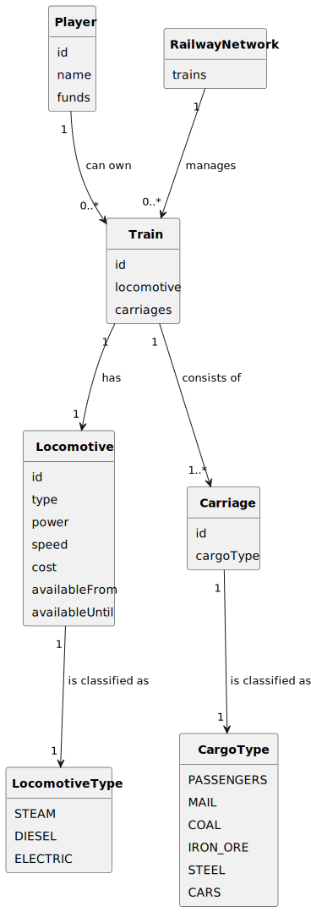

# US09 - As a Player, I want to buy a train 

## 2. Analysis

### 2.1. Relevant Domain Model Excerpt

The domain model excerpt shows the following classes and their relationships:

- **Train**: Represents a purchased train consisting of a locomotive and carriages.
- **Locomotive**: Represents the train's engine, with attributes like type (steam, diesel, electric), power, speed, cost, and availability period.
- **Carriage**: Represents a wagon that carries cargo (e.g., passengers, coal, mail).
- **Player**: Represents the user who purchases and manages trains.
- **RailwayNetwork**: Manages all trains and railway operations.

The relationships show that:
- A Train has exactly one Locomotive.
- A Train has one or more Carriages.
- A Player can buy zero or multiple Trains.
- The RailwayNetwork tracks all purchased trains.
- Locomotives and Carriages are strictly typed by their respective enums.

### 2.2. Other Remarks

The process of buying a train involves:

1. **Locomotive selection** - The player chooses a locomotive from the available list.
2. **Fund verification** - The system checks if the player has enough money.
3. **Carriage selection** - The player chooses at least one carriage.
4. **Train registration** - The system registers the train and updates the player’s funds.
5. **Success confirmation** - The system displays the new train details.

If the purchase is invalid (e.g., insufficient funds), the system will display an error message.