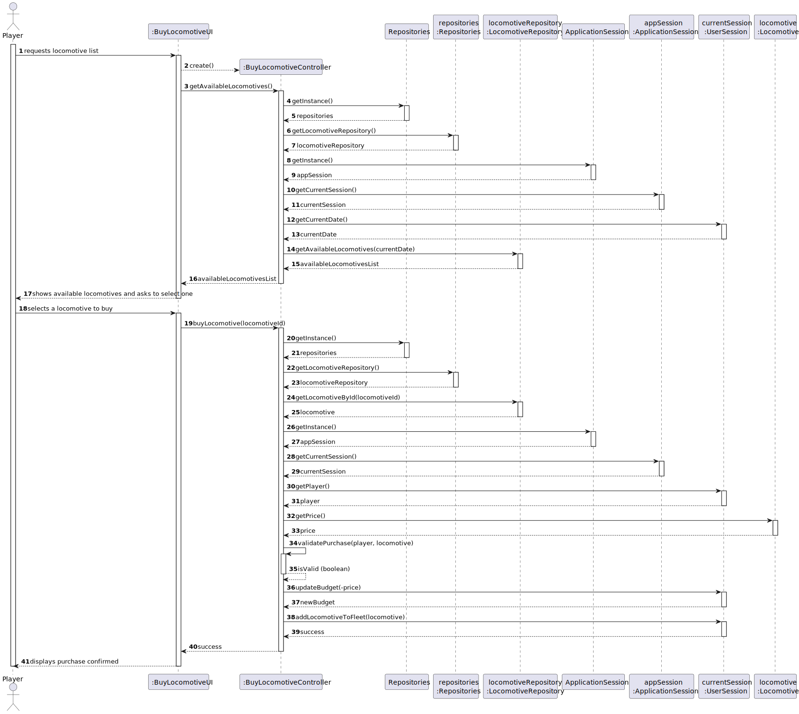
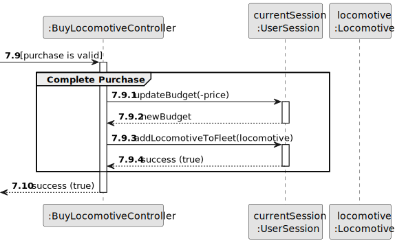
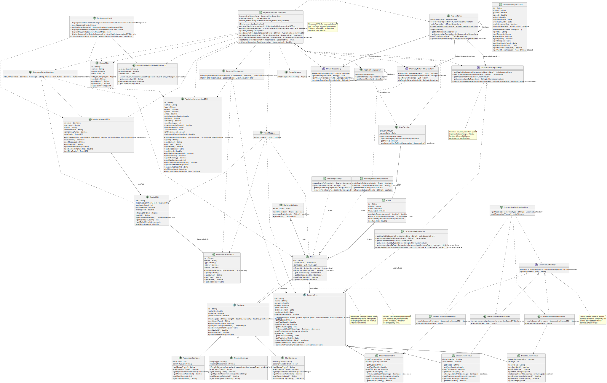

# US09 - As a Player, I want to buy a train

## 3. Design

### 3.1. Rationale

| Interaction ID | Question: Which class is responsible for... | Answer                  | Justification (with patterns)                                                                                       |
|:---------------|:--------------------------------------------|:------------------------|:--------------------------------------------------------------------------------------------------------------------|
| Step 1         | ... interacting with the actor?             | BuyLocomotiveUI         | Pure Fabrication: there is no reason to assign this responsibility to any existing class in the Domain Model.       |
|                | ... coordinating the US?                    | BuyLocomotiveController | Controller                                                                                                          |
| Step 2         | ... getting available locomotives?          | LocomotiveRepository    | IE: LocomotiveRepository maintains all available Locomotives.                                                       |
|                | ... accessing the repository?               | Repositories            | Creator and IE: knows and maintains the repositories.                                                               |
|                | ... knowing the current date?               | UserSession             | IE: knows the current game session date.                                                                            |
| Step 3         | ... validating the purchase?                | BuyLocomotiveController | Controller: combines domain knowledge to determine if the player can afford the locomotive.                         |
|                | ... getting the selected locomotive?        | LocomotiveRepository    | IE: can find and return a locomotive based on its ID.                                                               |
| Step 4         | ... updating the player's budget?           | UserSession             | IE: has access to the current player and can update their budget.                                                   |
|                | ... adding locomotive to player's fleet?    | UserSession             | IE: manages the player's game state including their train fleet.                                                    |
| Step 5         | ... informing operation success?            | BuyLocomotiveUI         | IE: is responsible for user interactions.                                                                           |

### Systematization ##

According to the taken rationale, the conceptual classes promoted to software classes are:

* Locomotive
* LocomotiveType
* Train
* Carriage
* CargoType
* Player
* RailwayNetwork

Other software classes (i.e. Pure Fabrication) identified:

* BuyLocomotiveUI
* BuyLocomotiveController
* Repositories
* LocomotiveRepository
* ApplicationSession
* UserSession

## 3.2. Sequence Diagram (SD)

### Full Diagram

This diagram shows the full sequence of interactions between the classes involved in the realization of this user story.

### Split Diagrams

The following diagram shows the same sequence of interactions between the classes involved in the realization of this user story, but it is split in partial diagrams to better illustrate the interactions between the classes.

It uses Interaction Occurrence (a.k.a. Interaction Use).

**Buy Selected Locomotive Partial SD**

**Get Available Locomotives Partial SD**

**Purchase Completion Partial SD**

**Validate Purchase Partial SD**

## 3.3. Class Diagram (CD)

