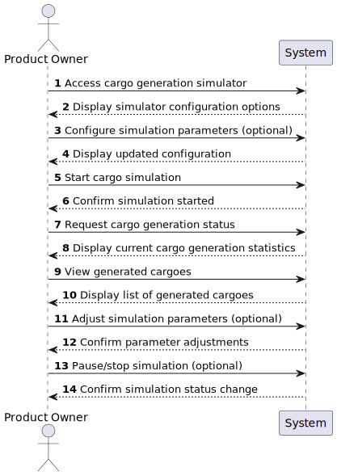

# US12 - Generate Cargoes Automatically at Stations

## 1. Requirements Engineering

### 1.1. User Story Description

As a Product Owner, I want to create a simulator that generates cargoes at current stations, automatically, considering the cities and industries that the railway network serves.

### 1.2. Customer Specifications and Clarifications 

From the specifications document:

- Cargoes represent goods that need to be transported between stations
- Different types of industries generate different types of cargo
- Cities create demand for various goods based on population and type
- Cargo generation should be balanced to maintain gameplay challenge

From client clarifications:

> **Question:** Should cargo generation dynamically update as the railway network expands or changes?
>
> **Answer:** Yes. the generation is done for the industries and house blocks served by the stations present in the network.

> **Question:** Will the user have customization options for cargo generation rules, or will it be fully automated?
>
> **Answer:**  Just in the edition of the scenario.

### 1.3. Acceptance Criteria

* **AC01:** This simulator should provide options for start/pause.

### 1.4. Found out Dependencies

* Requires stations to be built (dependency on US05 - Build a Station)
* Requires railway connections between stations (dependency on US08 - Build a Railway Line)
* Depends on industry types and city definitions in the scenario (US04)
* May depend on economic factors and time progression in the game

### 1.5 Input and Output Data

**Input Data:**
* Selected data:
    * Simulation interval setting
    * Cargo generation parameters (optional)
    
**Output Data:**
* List of newly generated cargoes
* Updated station cargo storage information
* Cargo distribution statistics
* Success/failure messages for cargo generation

### 1.6. System Sequence Diagram (SSD)

### 1.7 Other Relevant Remarks

* Cargo generation is a background process that simulates economic activity
* The simulation creates gameplay challenges and objectives for th  e player
* Future enhancements might include:
  * Seasonal cargo demand variations
  * Special high-value cargo opportunities
  * Emergency shipment scenarios
  * Economic growth affecting cargo generation rates