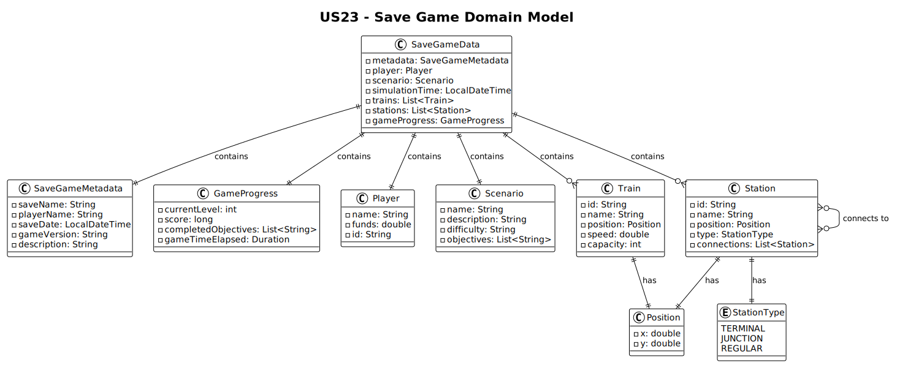

# US23 - Save a Simulation (Game) in a file for later use

## 2. Analysis

### 2.1. Relevant Domain Model Excerpt 



### 2.2. Other Remarks

From the analysis, we can observe that:

1. The `Player` entity contains all player-specific data that needs to be persisted.
2. The `GameSession` manages the current state of the simulation and coordinates with other components.
3. The `Scenario` defines the game rules and constraints that must be preserved.
4. `Train` entities with their current positions, cargo loads, and status must be saved.
5. `Station` entities with their current cargo and operational status need persistence.
6. The `SimulationRepository` can be extended to handle save/load operations.
7. A new `SaveGameService` should be created to coordinate the save operation.
8. The save file format should include:
   - Player information (name, financial status, achievements)
   - Current scenario data
   - All train states (position, cargo, destination, status)
   - All station states (cargo inventory, passenger counts)
   - Simulation time and game progress
   - Metadata (save date, game version, player name)

### 2.3. Save File Structure

The save file will follow this JSON structure:
```json
{
  "metadata": {
    "saveDate": "timestamp",
    "gameVersion": "version",
    "playerName": "string"
  },
  "player": {
    "name": "string",
    "money": "number",
    "achievements": []
  },
  "scenario": {
    "id": "string",
    "name": "string",
    "map": "reference"
  },
  "gameState": {
    "simulationTime": "timestamp",
    "trains": [],
    "stations": [],
    "gameProgress": {}
  }
}
```
