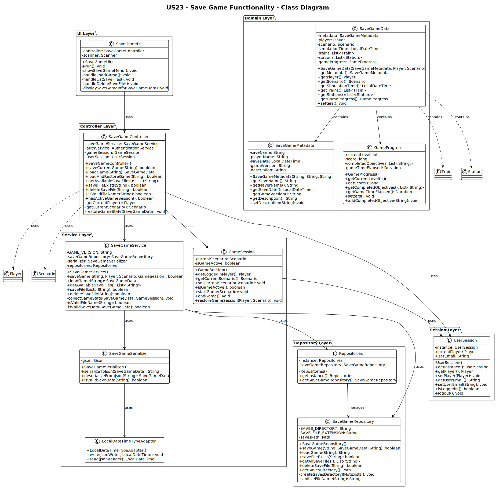

# US23 - Save a Simulation (Game) in a file for later use

## 3. Design

### 3.1. Rationale

| Interaction ID | Question: Which class is responsible for...       | Answer                   | Justification (with patterns)                                                                                 |
|:---------------|:--------------------------------------------------|:-------------------------|:--------------------------------------------------------------------------------------------------------------|
| Step 1         | ... interacting with the actor?                   | SaveGameUI               | Pure Fabrication: there is no reason to assign this responsibility to any existing class in the Domain Model. |
|                | ... coordinating the US?                          | SaveGameController       | Controller                                                                                                    |
|                | ... knowing the user using the system?            | AuthenticationService    | IE: cf. A&A component documentation.                                                                          |
|                |                                                   | UserSession              | IE: knows/has the currently logged in user                                                                    |
|                |                                                   | Player                   | IE: knows its own data (e.g. name, progress)                                                                 |
| Step 2         | ... getting the current game state?               | GameSession              | IE: manages the current simulation state.                                                                     |
|                | ... coordinating the save operation?              | SaveGameService          | Service: coordinates complex save operations involving multiple repositories.                                   |
| Step 3         | ... requesting save file name?                    | SaveGameUI               | IE: is responsible for user interactions.                                                                     |
| Step 4         | ... validating the file name?                     | SaveGameService          | IE: knows the rules for valid file names and save directory structure.                                        |
| Step 5         | ... creating the save data structure?             | SaveGameService          | IE: knows how to collect and structure all game data for persistence.                                         |
| Step 6         | ... getting player data?                          | Player                   | IE: knows its own data (money, achievements, name).                                                           |
| Step 7         | ... getting scenario data?                        | Scenario                 | IE: knows its own data and configuration.                                                                     |
| Step 8         | ... getting all train states?                     | TrainRepository          | IE: manages train persistence and can provide all current train states.                                       |
| Step 9         | ... getting all station states?                   | StationRepository        | IE: manages station persistence and can provide all current station states.                                   |
| Step 10        | ... serializing the game data?                    | SaveGameSerializer       | Pure Fabrication: specialized class for handling JSON/XML serialization.                                      |
| Step 11        | ... writing the save file?                        | SaveGameRepository       | Repository: handles file I/O operations and manages save file storage.                                        |
| Step 12        | ... handling file I/O errors?                     | SaveGameRepository       | IE: responsible for file operations and knows about potential file system errors.                             |
| Step 13        | ... informing operation success?                  | SaveGameUI               | IE: is responsible for user interactions and feedback.                                                        |

### Systematization

According to the taken rationale, the conceptual classes promoted to software classes are:

- Player
- Scenario
- Train
- Station
- GameSession

Other software classes (i.e. Pure Fabrication) identified:

- SaveGameUI
- SaveGameController
- SaveGameService
- SaveGameSerializer
- SaveGameRepository
- TrainRepository
- StationRepository
- AuthenticationService
- UserSession

## 3.2. Sequence Diagram (SD)

### Full Diagram

This diagram shows the full sequence of interactions between the classes involved in the realization of this user story.

### Split Diagrams

The following diagram shows the same sequence of interactions between the classes involved in the realization of this user story, but it is split in partial diagrams to better illustrate the interactions between the classes.

It uses Interaction Occurrence (a.k.a. Interaction Use).

**Get Game State Partial SD**

**Collect Save Data Partial SD**

**Write Save File Partial SD**

## 3.3. Class Diagram (CD)

## 3.4. Applied Patterns

This functionality applies the following patterns:

- **Controller**: SaveGameController acts as the intermediary between UI and service layers.
- **Service**: SaveGameService coordinates the complex save operation.
- **Repository**: SaveGameRepository handles persistence and file I/O.
- **Creator**: SaveGameService creates the save data structure.
- **Information Expert**: Each domain class provides its own data.
- **Pure Fabrication**: SaveGameSerializer handles the technical concern of serialization.
- **Low Coupling**: Classes are loosely coupled through interfaces.
- **High Cohesion**: Each class has a single, well-defined responsibility.

## 3.5. Tests 

**Test 1:** Check that it is possible to save a game with valid data.

**Test 2:** Check that it is not possible to save a game with invalid file name.

**Test 3:** Check that file I/O errors are handled gracefully.

**Test 4:** Check that save data includes all required game state information.

**Test 5:** Check that save file is created in the correct directory.
