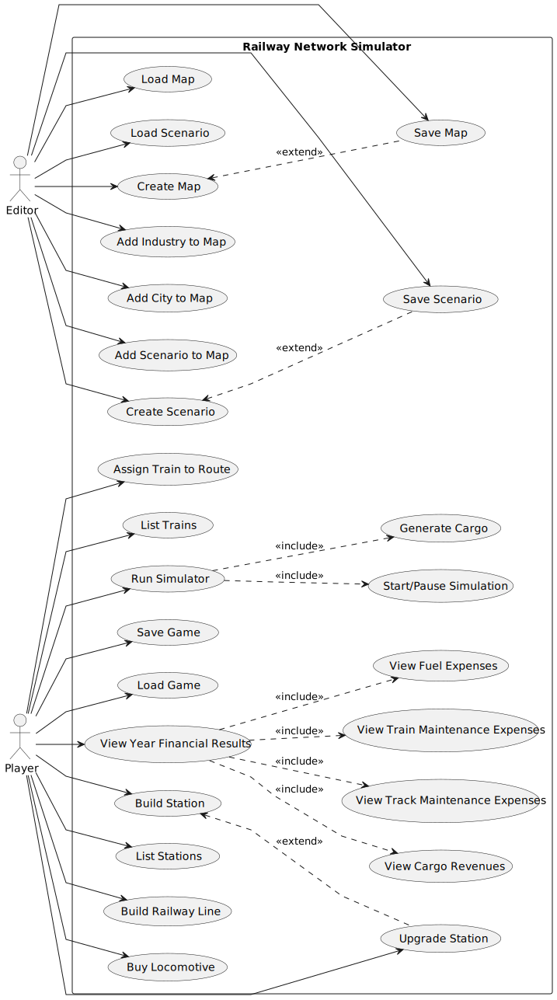

# Use Case Diagram (UCD)

**In the scope of this project, there is a direct relationship of _1 to 1_ between Use Cases (UC) and User Stories (US).**

However, be aware, this is a pedagogical simplification. On further projects and course units there may also exist _1 to N **and/or** N to 1_ relationships between UC and US.

**Insert below the Use Case Diagram in a SVG format**

**For each UC/US, it must be provided evidences of applying main activities of the software development process (requirements, analysis, design, tests and code). Gather those evidences on a separate file for each UC/US and set up a link as suggested below.**

# Use Cases / User Stories
| UC/US | Description                                      |                   
|:------|:-------------------------------------------------|
| US01  | [Create Map](../../US01/US01-README.md)          |
| US02  | [Add Industry to Map](../../US02/US02-README.md) |
| US03  | [Add City to Map](../../US02/US02-README.md)     |
| US04  | [Create Scenario](../../US04/US04-README.md)     |
| US05  | [Build Station](../../US05/US05-README.md)       |
| US06  | [Upgrade Station](../../US06/US06-README.md)     |
| US07  | [List Stations]()                                |
| US08  | [Build Railway Line](../../US08/US08-README.md)  |
| US09  | [Buy Locomotive](../../US09/README.md)           |
| US10  | [Assign Train to Route](../../US10/README.md)    |
| US11  | [List Trains](../../US11/US01-README.md)         |
| US12  | [Run Simulator](../../US12/US12-README.md)       |
| US19  | [Save Map]()                                     |
| US20  | [Load Map]()                                     |
| US21  | [Save Scenario]()                                |
| US22  | [Load Scenario]()                                |
| US23  | [Save Game]()                                    |
| US24  | [Load Game]()                                    |
| US25  | [View Financial Results]()                       |
